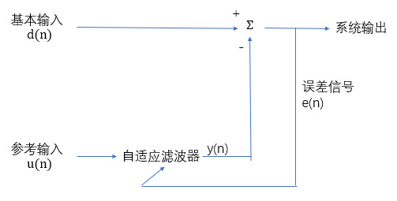
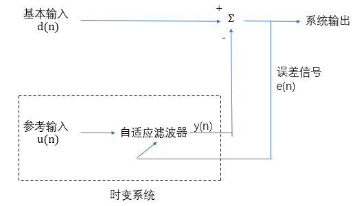

大三课设的选题是2017年电子设计大赛国赛的E题：自适应滤波器，其中比较关键的数据处理部分使用了LMS算法。总体的方案参考了这套方案，可以百度搜得到。时隔一年，现在对算法部分做一个总结。因为没有大数据处理和信号处理的基础，以下都是个人查找文献和书籍做的一些笔记。具体C语言算法的实现参考以下几篇博客：

[雅克比公式求矩阵最大特征值（C语言版）](https://blog.csdn.net/qq_32065823/article/details/81839325)

[LMS算法实现自适应滤波器（C语言版）](https://blog.csdn.net/qq_32065823/article/details/81839070)

## 正弦干扰的自适应噪声消除

传统方法：使用调整干扰频率的固定陷波器（带通、带阻滤波器），这要求我们必须知道干扰的精确频率，所要求的带通频率非常陡峭。

基本输入：由携带信息的信号和互不干扰的正弦干扰组成；

参考输入：相关形式的正弦干扰；

### 自适应滤波器：采用基于LMS算法进行抽头权值自适应的FIR滤波器，使用参考输入，对包含在基本输入端的正弦信号进行估计，从基本输入中减去自适应滤波器输出。

重要特征：

1. 消除器像自适应陷波器一样工作，其零值点由正弦干扰的角频率$\omega_0$决定。消除器是可调的，其调陷频率随$\omega_0$而变。
2. 通过选择足够小的$\mu$，可使得消除器频率响应的陷波在正弦干扰处很陡峭。

假设 输入数据是实数，则

对于基本输入 
$$d(n)=s(n)+A_0\cos(\omega_0n+\phi_0)$$

- $s(n)$：承载信息的信号

- $A_0$：正弦干扰的幅度

- $\omega_0$：归一化角频率

- $\phi_0$：相位

参考输入
$$u(n)=A\cos(\omega_0n+\phi)$$

使用实数的LMS算法，则抽头权的更新基于如下：

$$y(n)=\sum_{i=0}^{M-1}\omega_i(n)u(n-i)$$

$$e(n)=d(n)-y(n)$$

$$\omega(n+1)=\omega_i(n)+\mu u(n-i)e(n)$$

- $M$：FIR滤波器的长度

- $\mu$：步长因子常数

假设LMS算法中输入数据和其他信号的抽样周期取为单位时间，用正弦激励作为感兴趣的输入，重建自适应滤波器框图。

可将正弦输入$u(n)$、FIR滤波器和LMS算法的权值更新方程组合为一个单一（开环）的系统。

输入为$e(n)$、输出为$y(n)$的自适应系统随时间变化。

由于$z=e^{j\omega}$和$z_0=e^{j\omega_0}$，如令自适应系统的激励为$e(n)=z^n$，则输出$y(n)$包含三个分量：其一正比于$z^n$，其二正比于$z^n(z_0^{2n})^*$，其三正比于$z^n(z_0^{2n})$。

第一个分量代表转移函数为$G(z)$的时变系统。

$$u(n-i)=A\cos[\omega_0(n-i)+\phi]=\frac{A}{2}[e^{j(\omega_0n+\phi_i)}+e^{-j(\omega_0n+\phi_i)}]$$

其中$\phi_i=\phi-\omega_0i$。

输入$u(n-i)$与估计误差$e(n)$相乘，对$u(n-i)e(n)$做$z$变换并用$z[·]$表示。

$$z[u(n-i)e(n)]=\frac{A}{2}e^{j\phi_i}E(ze^{-j\omega_0})+\frac{A}{2}e^{-j\phi_i}E(ze^{j\omega_0})$$

$E(ze^{-j\omega_0})$是围绕单位圆逆时针旋转$\omega_0$角度后$e(n)$的$z$变换；

$E(ze^{j\omega_0})$是围绕单位圆顺时针旋转$\omega_0$后的变换。

对$\omega_i(n+1)=\omega_i(n)+\mu u(n-i)e(n)$进行$z$变换

$$z\omega_i(z)=\omega_i(z)+\mu z[u(z-i)e(n)]$$

$\omega_i(z)$是$\omega_i(n)$的$z$变换。

$$\omega_i(z)=\frac{\mu A}{2}\frac{1}{z-1}[e^{j\phi_i}E(ze^{-j\omega_0})+e^{-j\phi_i}E(ze^{j\omega_0})]$$

$$y(n)=\frac{A}{2}\sum^{M-1}_{i=0}\omega_i(n)[e^{(j\omega_0n+\phi_i)}+e^{-j(\omega_0n+\phi_i)}]$$

$z$变换得

$$Y(z)=\frac{A}{2}\sum^{M-1}_{i=0}[e^{j\phi_i}\omega_i(ze^{j\omega_0}+e^{j\omega_i}\omega_i(ze^{j\omega_0})]$$