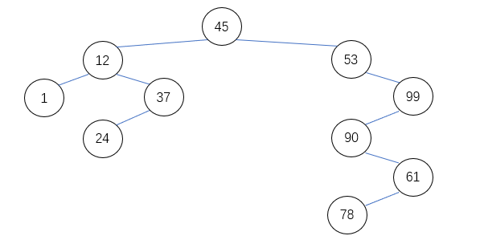
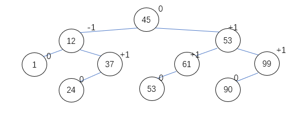

### 查找问题

“查找”是基于数据逻辑结构(D,R)定义的一种十分常见的运算。数学上，“查找”是指问题：“$x\in D ?$”。即查找是确定某个数据元素是否在数据元素上的问题。

如果R限定的关系为D中的数据元素构成一个集合的话，此时称为查找表（Search Table），即查找表定义为同一类型的数据元素（或记录）构成的集合。

通常，$D=\{ a_1,a_2,...,a_i,...,a_n\}$的每个数据元素$a_i$具有唯一标识的分量，被称为关键字，记为：$a_1.key$。

用以识别若干数据元素（或记录）的数据称为次关键字。

$$x\in D\leftrightarrow x.key\in \{ a_1.key,a_2.key,...,a_i.key,...,a_n.key \}$$

如果D中存在给定关键字的数据元素，则称为“查找成功”，否则称为“查找失败”。

查找运算的一般定义形式为`Search(T,x.key)`，`Search(T,x.key)`的返回值，通常采用下列3种形式之一。

$$
Search(T,key)=\begin{cases}
True\quad(key\in T)\\
False\quad(key\notin T)\\
\end{cases}
$$

$$
Search(T,key)=\begin{cases}
i\quad(key\in T,k_i=key)\\
0\quad(key\notin T)\\
\end{cases}
$$

$$
Search(T,key)=\begin{cases}
p\quad(key\in T,k_i=key)\\
NULL\quad(key\notin T)\\    
\end{cases}
$$

对于查找表可以进行的操作有：

1. 查询某个特定的数据元素是否在查找表中；
2. 检查某个特定的数据元素的各种属性；
3. 在查找表中插入一个数据元素；
4. 从查找表中删除某个数据元素。

如果限定对于某个查找表，只允许执行第1和第2种操作，称为静态查找表，即静态查找表内容不允许发生改变。否则，如果查找表同时允许执行第1、第2、第3和第4种操作，则称其为动态查找表。

$T(n)$：在查找表中查找某一元素的时间开销计为$T(n)$，其通常与问题规模$n$相关，$n$定义为查找表中数据元素的个数。

$T_{best}(n)$：指最好情况下的时间开销；

$T_{worst}(n)$：指最坏情况下的时间开销；

对于基本“计较”操作实现的查找算法，时间开销$T(n)$主要来源于关键字值K，往往需要跟查找表中的多个数据元素的关键字值进行比较，称这种关键字值比较次数的数学期望值为平均查找长度（Average Search Length），记为ASL。

### 顺序表的查找

#### 哨兵技术

- 首先将待查找的那个数据元素存放在顺表表的边界，即执行赋值语句`a[0]=x`；
- 然后从`a[n]`开始进行逆序方向进行查找。

“查找成功”的情况

查找成功的位置|关键字比较的次数
:--:|:--:
n|1
n-1|2
n-2|3
...|...
i|n-i+1
...|...
3|n-2
2|n-1
1|n

平均查找长度：$T_{average}(n)=O(n)$

“查找失败”的情况

在“查找失败”的情况下，需要与所有关键字比较一次，共计n次。

#### 折半查找法

适用于有序表，这里用递增有序表来讲解。

算法思想：与处于查找表中间位置关键字比较。如果等于给定值，则查找成功，返回成功值；如果大于给定值，在表的左部折半法查找；如果小于给定值，在表的右部折半法查找；仅当左部或右部为空时候，查找失败，返回失败值。

公式：$mid=(low+high)/2$

顺序查找表的左半部分查找，$low$不变，$high$为$mid-1$；

顺序查找表的右半部分查找，$high$不变，$low$为$mid+1$；

$low\leq high$时，表示顺序查找子表非空，如果没查到数据元素，可以继续查找。

``` C++
Typedef struct
{
    Elemtype *elem;
    int length;
}SSTable;
int Search(SSTable T, KeyType k)
{
    low=1;
    high=T.length;
    while(low<=high)
    {
        mid=(low+high)/2;
        if(T.elem[mid]==k)
            return mid;  //等于，成功
        else if(T.elem[mid]>k)
            high=mid-1;  //左部
        else
            low=mid+1;  //右部
    }
    return 0；  //失败
}
```

算法分析：规模为表长$n$，统计关键字之间的比较次数。

最少的比较次数是1次，最多比较次数是树的高度。

即：$T_{best}(n)=O(1), T_{worst}(n)=O(log_2n)$。

$$ASL(s)=\frac{n+1}{n}log_2(n+1)-1$$

#### 分块查找法

利用关键字序列的分段（块）有序性，建立分段（块）索引表。借助分段索引表，实现快速查找。这种方法称为分块查找法。

算法思想：

1. 在分段索引表中“顺序”或“折半”查找给定值所在的块；
2. 在1确定的块中，顺序查找给定值。

算法分析：假设在索引表上的平均查找长度为$ASL_b$，在查找表上的平均查找长度为$ASL_w$，则

$$ASL=ASL_b+ASL_w$$

##### 顺序查找法确定块

$$ASL=\frac{1}{2}(\frac{n}{s}+s)+1$$

显然，当$s=\sqrt{n}$时，$ASL$达到最小值。

##### 折半查找法确定块

$$ASL\approx log_2(\frac{n}{s}+1)+\frac{s}{2}$$

- 分块查找法需要划分块，建立分块索引表。其中，分块要求查找表呈现分块有序性，分块有序性通常属于“自然天成”的。（例如：高校历届毕业生的归档资料）。

- 分块查找法可以推广，可以建立多级分块查找法。

### 二叉排序树

一棵二叉排序树或者是一棵空树，或者是满足下列性质的一棵非空的二叉树T：

1. 如果T的左子树非空，则左子树中所有结点值小于T的的根节点的值；
2. 如果T的右子树非空，则右子树所有结点值大于T的根节点值；
3. T的左子树和右子树均为二叉排序树。



#### 二叉排序树“查找”算法

``` C++
BiTree *Locate(BiTree *T, KeyType K)
{
    if(T) return NULL;
    if(T->data.key==K) return T;
    if(T->data.key<K) 
        T=T->lchild;
    else
        T=T->rchild;
    return Locate(T, K); 
}
```

#### 二叉排序树“插入”算法

`Insert(&T, K)`

T表示一棵已经存在的一棵二叉排序树的根节点，K为待插入的数据元素的关键字。

根据给定的关键字K，在T为根节点的二叉排序树中查找，并在失败处插入该元素。

#### 二叉排序树“创建”算法

基本思想：先初始化一棵二叉排序树的根节点为空。然后不断地往这棵二叉排序树中，根据查找表中数据元素顺序插入数据元素。

#### 二叉排序树“删除”算法

假设二叉树排序树上被删除节点为`*p`，其双亲节点为`*f`，且不失一般性，假设`*p`是`*f`的左孩子。

二叉排序树节点的“删除”，可以分为4种情况分别进行处理。

**情况一**：待“删除”的结点，左右子树均为空子树。修改其双亲节点的指针实现删除结点。

**情况二**：待“删除”的结点`*p`，其左子树为空子树，右子树为非空子树`Pr`。将`Pr`成为`*f`的左子树即可。

**情况三**：“删除”的结点`*p`，其左子树为非空子树`Pl`，右子树为空子树。将`Pl`成为`*f`的左子树即可。

**情况四**：待“删除”的结点左右子树均为非空子树。被删除节点为`*p`，其双亲节点为`*f`，且不失一般性，假设`*p`是`*f`的左孩子。结点`*s`是被删除结点`*p`的左孩子节点的右子树中的，沿着右孩子指针路径下去的，直到无右孩子的结点。

- 方法一：删除结点`P`，令`*p`的左子树为`*f`的左子树，而`*p`的右子树为`*s`的右子树。
- 方法二：结点`*s`替换结点`*p`（即删除删除结点`P`），结点`*s`的左子树作为结点`*s`的父结点`*q`的右子树。
  
#### “查找”算法分析

假设二叉排序树有n个结点，最少的比较次数是1次，最多比较次数是树的高度h。

有$T_{best}(n)=O(1),\quad T_{worst}(n)$。

### 平衡二叉树

平衡二叉树（Balanced Binary Tree）又称为AVL树。它或是一棵空树，或是满足下列性质的一棵非空的二叉树T：

1. T的左子树和右子树的深度之差的绝对值不超过1；
2. T的左子树和右子树均为平衡二叉树。



#### 平衡二叉排序树“创建”算法

算法思想：根据关键字序列，对每一个关键字K，逐个在平衡二叉排序树T上查找，在失败处插入该关键字K；如果插入时T失去平衡，对最小不平衡子树进行平衡化处理。

**最小不平衡子树**：是从插入结点k到二叉平衡树T的根之路劲上，距离结点k最近的、平衡因子绝对值>1的结点为根的子树。

#### 平衡化处理

对于最小不平衡二叉树，可以根据导致失去平衡的插入位置，分为LL型、RR型、LR型和RL型4种情况，并分别进行平衡化处理。

**LL型**：插入点是最小不平衡子树的左子树的左子树，处理的办法是“单向右旋”。

**RR型**：插入点是最下不平衡子树的右子树的右子树，处理的办法是“单向左旋”。

**LR型**：插入点是最小不平衡子树的左子树的右子树。处理的办法是“左旋右旋”。

**RL型**：插入点是最小不平衡子树的右子树的左子树。处理的办法是“右旋左旋”。

### 哈希查找法

一个哈希函数$H(k)$的作用是计算关键字K对应的数据元素的存储地址。

这种不依赖与“比较”运算给，而是依靠算术“计算”的查找方法，在理想状况，最坏时间复杂性可以达到常量级，即：$T_{worst}(n)=O(1)$。

- 其定义域要考虑到理论上可能出现的所有关键字。
- 哈希表要考虑存储空间的有效利用和可行性，哈希函数的值域取决于实际上出现关键字的数量，即实际取值范围。

**基本原则**

“均匀的（Uniform）哈希函数”，避免冲突情况即同义词的过度集中，预期哈希查找的平均时间效率能够到达最佳。

如果对于关键字集合的每个关键字key，经哈希函数$H(key)$映射到哈希地址集合中的任何一个地址之概率是相等的，则称哈希函数$H(key)$为均匀的（Uniform）哈希函数。

#### 哈希函数的构造方法

- 直接定址法：取关键字的某个线性函数值作为哈希地址。
    
    $$H(key)=a\times key+b\quad(a\not ={0})$$
    即：$T_{worst}=O(1)$
- 数字分析法：对于可能出现的关键字集，事先分析这些关键字的每一位，选择其中“若干”“随机”位构成其哈希地址。  
- 平方取中法：取关键字平方后的中间若干位为哈希地址。
- 折叠法：将关键字分割成位数相同的若干个段，然后各段叠加求和作为哈希地址。
- 余数法：取关键字被不大于哈希表长m的某个数p除后的余数为哈希地址。
    $$H(key)=key\ MOD \ p\quad (p\leq m)$$

    一般情况下，p为一个质数或为不含小于20质因子的一个合数。

#### 处理冲突的方法

##### 开放地址法
    
当关键字key在哈希函数$H(key)$出现冲突的情况时，在$H(key)$为起点，取一个增量di，作为下一个探测的位置。即：

$$H_i(key)=(H(key)+di)\ MOD\ m$$

对于增量di，可以3种取法：
1. 线性探测$d_i=i\quad(i=1,2,3,...,m-1)$
2. 二次探测$d_i=1^2,-1^2,2^2,-2^2,3^2,...,\pm k^2,(k\leq m/2)$
3. 伪随机探测再散列

#### 再哈希法

但关键字key再哈希函数$H(key)$出现“冲突情况”时，依次采用其它哈希函数$RH_i$计算关键字key的下一个地址，直到冲突不再发生为止。

$$H_i(key)=RH_i(key)\quad(i=1,2,3...,k)$$

#### 链地址法

将关键字的同义词存储在各自的单链表中。

#### 公共溢出区法

当增加关键字到哈希表中遇到冲突时，将所有同义词统一存储到“公共溢出区”中。

### 哈希查找及其分析

哈希“查找”算法

1. 在给定关键字key值对应计算的哈希地址$H(key)$处查找；
2. 如果查找不成功，根据处理冲突办法确定“下一个地址”处查找；
3. 重复第二步，直到查找成功、或遇到“结束标志”为止。

说明:

- “下一个地址”和“结束标志”是由处理冲突办法决定的；
- 查找算法中既使用了“算术”运算，又使用了“比较”运算；
- “插入”算法是在查找失败处增加新关键字；
- “创建”算法可以循环调用“插入”运算实现；
- “删除”运算的实现实在查找成功处删除某个数据元素。对于某些处理冲突的办法，删除实际上是填入“删除标志”。

