## 单链表

单链表指的是线性表的每个结点，分散地存储在内存空间中，向后依次用一个指针串联起来。

### 单链表的一般形式

#### 不带表头结点

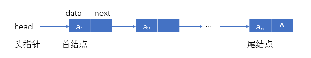

其中：`data`称为数据域，`next`称为指针域/链域；当`head==NULL`时，为空表；否则为非空表，表为一个非空表时，在首结点，`*head`中会存放数据。

#### 带表头结点

##### 非空表

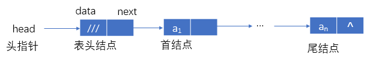

##### 空表

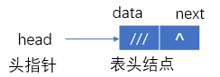

其中：`head`指向表头结点，`head->data`不放元素，`head->next`指向首结点$a_1$，当`head->next==NULL`时，为空表。

### 单链表的结点结构

``` C++
struct node
{
    ElemType data;    //data为抽象元素类型
    struct node *next;    //next为指针类型
};
//指向结点的指针变量head、p、q说明
struct node *head, *p, *q;
```

### 生成单链表

例1：输入一列整数，以0为结束标志，生成“先进先出”单链表


这个单链表之所以称为先进先出单链表就是因为先进来的元素；通过变化表头指针可以先被删除。

首先定义结点空间所占大小，结点的数据域为整型数，然后定义指针域`next`。

``` C++
#define LENG sizeof(struct node)    //结点所占单元数
struct node    //定义结点类型
{
    int data;
    struct node *next;
};
```

每次输入元素后：

1. 生产新结点：`p=malloc(结点大小); p->data=e; p->next=NULL;`
2. 添加到表尾：`tail->next=p;`
3. 设置新表尾：`tail=p;`

#### 生成“先进先出”单链表（链式队列）

``` C++
struct node *creat1()
{
    struct node *head, *tail, *p;
    int e;
    head=(struct node *)malloc(LENG);    //生成表头结点
    tail=head;    //尾指针指向表头
    scanf("%d", &e);    //输入第一个数
    while(e!=0);    //不为0
    {
        p=(struct node *)malloc(LENG);    //生成新结点
        p->data=e;    //装入输入的元素e
        tail->next=p;    //新结点链接到表尾
        tail=p;    //尾指针指向新结点
        scanf("%d", &e);    //再输入一个数
    }
    tail->next=NULL;    //尾结点的next置为空指针
    return head;    //返回头指针
}
```

#### 生成“先进后出”单链表（链式栈）


每次插入新元素后：

1. 生成新结点：`p=malloc(结点大小); p->data=e;`
2. 新结点指针指向原首结点：`p->next=head->next;`
3. 新结点作为首元素：`head->next=p;`

``` C++
struct node *creat2()
{
    struct node *head, *p;
    head=(struct node *)malloc(LENG);    //生成表头结点
    head->next=NULL;    //置为空表
    scanf("%d", &e);    //输入第一个数
    while(e!=0);    //不为0
    {
        p=(struct node *)malloc(LENG);    //生成新结点
        p->data=e;    //输入数送新结点的data
        p->next=head->next;    //新结点指向原首结点
        head->next=p;    //表头结点的指针指向新结点
        scanf("%d", &e);    //再输入一个数
    }
    return data；    //返回头指针
}
```

### 插入一个结点

例1：在已知`p`指针指向的结点后插入一个元素`x`

首先用一个指针`f`指向新结点，该结点中的数据域为`x`，然后此新结点`next`域赋值为`p`指针指向结点的`next`域，最后`p`指针指向结点的`next`域赋值为`f`。

``` C++
f=(struct node *)malloc(LENG);    //生成
f->data=x;    //装入元素x
f->next=p->next;    //新结点指向p的后继
f->next=f;    //新结点成为p的后继
```

例2：在已知`p`指针指向的结点前插入以一个元素`x`

因为单链表每个结点只有一个指针指向其后继结点，如果在结点前插入一个新结点，就需要得到指向`p`结点前驱结点的指针。

``` C++
f=(struct node *)malloc(LENG);
f->data=x;
f->next=p;    //新结点成为p的前驱
q->next=f;    //新结点成为p的前驱结束的后继
```

### 单链表的算法

#### 表头结点的作用

例：输入一列整数，以0为结束标志，生成递增有序单链表。


可以分为以下几种情况：

1. `p`、`q`同时空，意味着往空表中插入第一个结点；
2. 仅`p`为空，`q`不为空，尾部插入，即数据插入到链表的尾部；
3. （仅`q`为空）首部插入，即插入的数据作为单链表的第一个结点。
　　

`p`、`q`可能为NULL

1. （`p`、`q`同时空）空表插入；`f->next=p;`
2. （仅`p`为空）尾部插入；`q->next=f;`
3. （仅`q`为空）首部插入；`q`不可能为空。
　　

注意一点每次扫描已经存在的单链表确定数据插入的位置之前，做如下的初始化：

``` C++
struct node *creat3_1(struct node *head, int e)
{
    q=NULL;
    p=head;    //p、q扫描，查找插入位置
    while(p&&e>p->data)    //未扫描完，且e大于当前结点
    {
        q=p;
        p=p->next; 
    }
    f=(struct node *)malloc(LENG);    //生成新结点
    f->data=e;    装入元素e
    if(p==NULL)
    {
        f->next=NULL;
        if(q==NULL)    //对空表的插入
            head=f;
        else
            q->next=f;
    }    //作为最后一个结点插入
    else if(q==NULL)    //作为第一个结点插入
    {
        f->next=p;
        q->next=f;    //一般情况插入新结点
    }
    return head;
}
```

主函数算法

``` C++
main()
{
    struct node *head;    //定义头指针
    head=NULL;    //置为空表
    scanf("%d", &e);    //输入整数
    while(e!=0)    //不为0，未结束
    {
        head=creat3_1(head, e)    //插入递增有序单链表
        scanf("%d", &e);
    }
}
```

##### 生成带头结点的递增有序单链表（不包括0）

``` C++
void creat3_2(struct node *head, int e)
{
    q=head;
    p=head->next;    //p、q扫描，查找插入位置
    while(p&&e->p->data)    //未扫描完，且e大于当前结点
    {
        q=p;
        p=p->next;    //q、p后移，查下一个位置
    }
    f=(struct node *)malloc(LENG);    //生成新结点
    f->data=e;    //装入新元素e
    f->next=p;
    q->next=f;    //插入新结点
}
```

主函数算法

``` C++
main()
{
    struct node *head;    //定义头指针
    head=NULL;    //置为空表
    scanf("%d", &e);    //输入整数
    while(e!=0)    //不为0，未结束
    {
        head=creat3_2(head, e)    //插入递增有序单链表
        scanf("%d", &e);
    }
}   
```

#### 单链表的指定位置插入新元素
　　
输入：头指针`L`、位置`i`、数据元素`e`

输出：成功返回OK，失败返回ERROR

计数如果在第`i`个位置上结束，`p`指向第`i`个位置，新元素就要插入到`p`指向的结点之前，我们之前分析过，如果插入到某个结点之前，就需要另一个复制指针`q`来指向`p`的前驱结点。

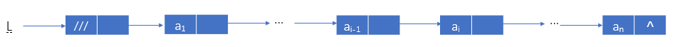

执行：`p=L`

当`p`不为空，执行`p=p->next` `i-1`次

定位到第`i-1`个结点

当`i<1`或`p`为空时插入点错

否则新结点加到`p`指向结点之后

``` C++
int insert(Linklist &L, int i, ElemType e)
{
    p=L;
    j=1;
    while(p&&j<i)
    {
        p=p->next;    //p后移，指向下一个位置
        j++;
    }
    if(i<1||p==NULL)    //插入点错误
        return ERROR;
    f=(Linklist)malloc(LENG);    //生成新结点
    f->data=e;    //装入元素e
    f->next=p->next;
    p->next=f;    //插入新结点
    return OK;
}
```

主要是三个大的部分：

1. 扫描定位；
2. 判断插入点位置为合法性；
3. 在 p 指定的位置后面插入到新的结点。

#### 在单链表中删除一个结点

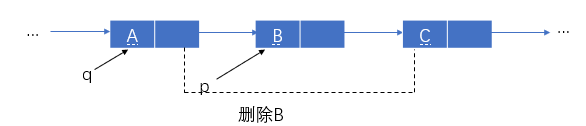

1. 执行：`q->next=p->next;　　//A的next域=C的地址(B的next)`
2. 执行：`free(p);　　//释放 p 所指向的结点空间`

##### 算法1：在带表头结点的单链表中删除元素值为e的结点

``` C++
int Delete1(Linklist head, ElemType e)
{
    struct node *q, *p;
    q=head;
    p=head->next;    //q、p扫描
    while(p&&p->data!=e)    //查找元素为e的结点
    {
        q=p;    //记住前一个结点
        p=p->next;    查找下一个结点
    }
    if(p)    //有元素为e的结点
    {
        q->next=p->next;    //删除该结点
        free(p);    //释放结点所占的空间
        return YES;
    }
    else
        return NO;    //没有删除结点
}
```

##### 算法2：在单链表中删除指定位置的元素

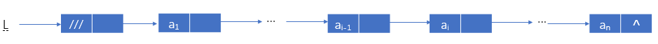

执行：`p=L`;

当`p`不为空，执行`p=p->next` `i-1`次，定位到第`i-1`个结点

当`i<1`时或`p->next`为空时删除点错，否则`p`指向后继结点的后继跳过原后继

``` C++
int Delete2(Linklist &L, int i, ElemType &e)
{
    p=L;
    j=1;
    while(p->next&&j<i)    //循环结束时p不可能为空
    {
        p=p->next;    //p后移，指向下一个位置
        j++;
    }
    if(i<1||p->next==NULL)    //删除点错误
        return ERROR;
    q=p->next;    //q指向删除结点
    p->next=q->next;    //从链表中指出
    e=q->data;    //取走数据元素值
    free(p);    //释放结点空间
    return OK;
}
```

### 单链表的合并

两个有序单链表的合并算法

将两个有序单链表`La`和`Lb`合并为有序单链表`Lc`；（该算法利用原单链表的结点）

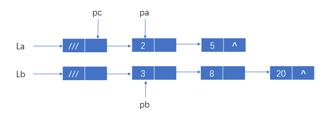

输入：两单链表的头指针

输出：合并后的单链表的头指针

``` C++
struct node *merge(struct node *La, struct node *Lb)
{
    struct node *pa, *pb, *pc;
    pa=La->next;    //pa指向表La的首结点
    pb=Lb->next;    //pb指向表Lb的首结点
    pc=La；    //使用表La的头结点，pc为尾指针
    free(Lb);    //释放表Lb的头结点
//比较pa指向pb指向结点的数据域值大小
    while(pa&&pb)    //表La表Lb均有结点
    if(pa->data<=pb->data)    //取表La的一个结点
    {
        pc->next=pa;    //插在表Lc的尾结点之后
        pc=pa;    //变为表Lc新的尾结点
        pa=pa->next;    //移向表La下一个结点
    }
    else    //取表Lb的一个结点
    {
        pc->next=pb;    //插在表Lc的尾结点之后
        pc=pb;
        pb=pb->next;
    }
    if(pa)
        pc-next=pa;    //插入表La的剩余段
    else
        pc->next=pb;    //插入表Lb的剩余段
    return La;
}
```

## 循环链表

### 一般形式

#### 带表头结点的非空循环单链表

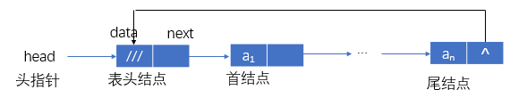

有：`H->next≠H，H≠NULL`。

#### 带表头结点的空循环单链表

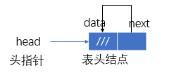

有：`H->next≠H，H≠NULL`。

### 只设尾指针的循环链表

#### 非空表

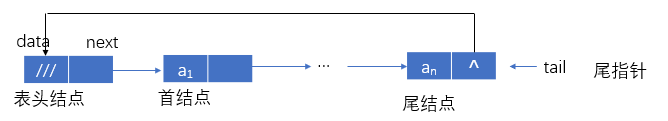

有：`tail`指向表尾结点

`tail->data=an`

`tail->next`指向表头结点

`tail->next->next`指向首结点

`tail->next->next->data=a1`

#### 空表

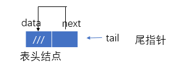

有：tail->next=tail

#### 例：两循环链表首尾相连

如果是带头指针，时间复杂度$O(m+n)$

如果使用只设尾指针的循环链表

``` C++
p2=tail2->next;
tail->next=tail->next;
tail1->next=p2->next;
free(p2);
```

时间复杂度$O(1)$

### 循环链表算法举例
　　
例：求以head为头指针的循环单链表的长度，并依次输出结点的值。

``` C++
int length(struct node *head)
{
    int leng=0;    //长度变量初值为0
    struct node *p;    
    p=head->next;    //p指向首结点
    while(p!=head)    //p未移回到表头结点
    {
        printf("%d", p->data);    //输出
        leng++;    //计数
        p=p->next;    //p移向下一个结点
    }
    return leng;
}
```

### 双向链表

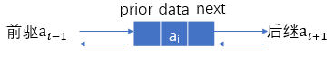

``` C++
//结点类型定义
struct Dnode
{
    ElemType data;    //data为抽象元素类型
    struct Dnode *prior, *next;    //prior，next为指针类型
};
//或者
typedef struct Dnode
{
    ElemType data; 
    struct Dnode *prior, *next;
} *DList
```

#### 一般形式

##### 非空表

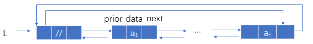

有：`L`为头指针，`L`指向表头结点，`L->next`指向首结点

`L->next->data=a1`

`L->prior`指向尾结点，`L->prior->data=an`

`L->next->prior=L->prior->next=NULL`

##### 空表


有：`L->next=L->prior=NULL`

#### 双向循环链表

##### 空表

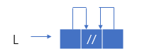

有：`L->next=L->prior=L`

##### 非空表

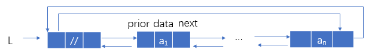

设`p`指向`a1`，有：

`p->next`指向`a2`，`p->next->prior`指向`a1`

所以，`p=p->next->prior`

同理，`p=p->prior->next`

##### 已知指针p指向结点B，删除B

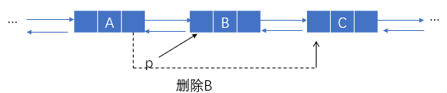

``` C++
//执行
p->prior->next=p->next;    //结点A的next指向结点C
p->next->prior=p->prior;    //结点C的prior指向结点A
free(p);    //释放结点B占有的空间
```

##### 已知指针p指向结点C，在A，C之间插入B

``` C++
f->prior=p->prior;    //结点B的prior指向结点A
f->next=p;    //结点B的next指向结点C
p->prior->next=f;    //结点A的next指向结点B
p->prior=f;    //结点C的prior指向结点B
```


