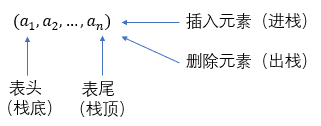
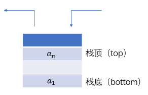
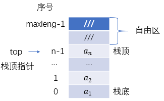
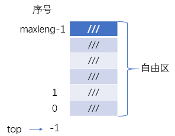
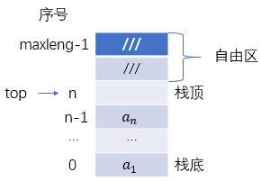
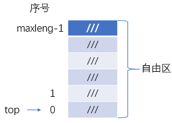
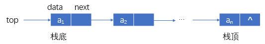
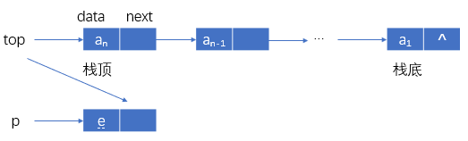
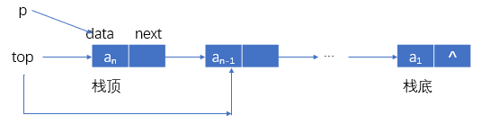

### 栈的概念与特性

一般的线性表插入和删除位置是没有限制的，而栈和队列对插入与删除的位置有限制，从而在相关操作上有一定的特殊性。

栈：限制在表尾作插入、删除操作的线性表





进栈：插入一个元素到栈中。或称：入栈、推入、压入、push。

出栈：从栈删除一个元素。或称：退栈、上托、弹出、pop。

栈顶：允许插入、删除元素的一端（表尾）。

栈顶元素：处在栈顶位置的元素。

栈底：表中不允许插入、删除元素的一端。

空栈：不含元素的栈。

栈的元素的进出原则：“先进后出”。

### 栈的基本操作

``` C++
Initstack(s); //置s为空栈
Push(s,e); //元素e进栈。若s为满，则发生溢出，若不能解决溢出，重新分配空间失败，则插入失败。
Pop(s,e); //删除s的顶元素，并送入e。若s为空栈，发生“下溢”。为空栈时，表某项任务已经完成
Gettop(s,e); //栈s的顶元素拷贝到e。若s为空栈，操作结束。
Empty(s); //判断s是否为空栈。若s为空栈，则Empty(s)为ture；否则为false。
```
### 理解栈操作

栈是输入与输出操作限制在栈顶位置进行的数据结构。

假设A、B、C进栈，不可能产生CAB的出栈顺序。

一般地，输入序列$(..., a_i, ..., a_j, ..., a_k, ...)$到栈中，不能得到输出序列$(..., a_k, ..., a_i, ..., a_j, ...)$。

### 顺序栈的基本操作

顺序栈：用顺序空间表示的栈

#### 设计实现方案时需要考虑的因素：

如何分配存储空间

- 动态分配或静态分配
- 栈空间范围，如：s[0...maxleng-1]

如何设置进栈和出栈的标志top

- 如top指向栈顶元素或指向栈顶元素上一空单元等，作为进栈与出栈的依据。

分析满栈的条件，用于进栈操作。

分析空栈的条件，用于出栈操作。

### 针对top指向栈顶元素或指向栈顶元素下一空单元分别进行基本操作的讲解。

#### 方案1

方案内容 

栈空间范围为：s[0...maxleng-1]

顶指针指向顶元素所在位置：



1. 非空栈示意图 top≥0 顶元素=s[top]

2. 进出栈说明

    - 进栈操作：先对top加1，指向下一空位置，将新数据送入top指向的位置，完成进栈操作。结束时top指向新栈顶元素所在位置。
    - 出栈操作：先根据top指向，取出栈顶数据元素；再对top减1。完成出栈操作。结束时top指向去掉原栈顶元素后的新栈顶元素所在位置。

3. 满栈条件 `top==maxleng-1` 若插入元素，将发生溢出。overflow。



4. 空栈条件 `top==-1` 执行操作，则发生下溢。

#### 方案2

方案内容

栈空间范围为：s[0...maxleng-1]

顶指针指向顶元素上的一空位置：




1. 非空栈示意图 top≥1 顶元素=s[top-1]

2. 进出栈操作说明：

    - 进栈操作：先将新数据送入top指向的位置，再对top加1，指向下一空位置，完成进栈操作。结束时，top正好指向新栈顶元素所在位置上的一空位置。
    - 出栈操作：先对top减1，根据top指向取出栈顶数据，完成出栈操作。结束时top指向去掉原栈顶元素后的新栈顶元素所在位置上的一空位置。

3. 满栈条件 `top==maxleng` 若插入元素，将发生“溢出”。



4. 空栈条件 `top==0` 若删除元素，则发生下溢。

### 顺序栈的描述

栈元素与顶指针舍弃定义为一个记录（结构）

约定：

- 栈元素空间为[0...maxleng-1]
- top指向栈元素上一空位置。
- **top是栈顶标志，根据约定由top找栈顶元素。

存储空间分配方案

#### 静态分配

``` C++
typedef struct
{
    ElemType elem[maxleng-1]; //栈元素空间
    int top; //顶指针
} SqStack; //SqStack为结构类型
SqStack s; //s为结构类型变量
```

其中：s.top——顶指针 s.elem[s.top-1]——顶元素

#### 动态分配

``` C++
#define STACK_INIT_SIZE 100
#define STACKINCREMENT 10
typedef struct
{
    ElemType *base; //指向栈元素空间
    int top; //顶指针
    int stacksize; //栈元素空间大小，相当于maxleng
} SqStack; //SqStack为结构类型
SqStack s;
```

### 顺序栈的算法

#### 初始化栈（动态分配）

``` C++
void InitStack(SqStack &s)
{
    s.base=(ElemType *)malloc(STACK_INIT_SIZE*sizeof(ElemType));
    s.top=0;
    s.stacksize=STACK_INIT_SIZE;
}
```

#### 进栈算法

``` C++
int push(SqStack &s, ElemType x)
{
    if(s.top>=s.stacksize) //发生溢出，扩充
    {
        newbase=(ElemType *)relloc(s.base, (s.stacksize+STACKINCREMENT)*sizeof(ElemType));
        if(!newbase)
        {
            printf("Overflow");
            return ERROR;
        }
        free(s.base);
        s.base=newbase;
        s.stacksize+=STACKINCREMENT;
    }
    s.base[s.top]=x; //装入元素x
    s.top++; //修改顶指针
    return OK;
}
```

#### 出栈算法

``` C++
int pop(SqStack &s, ElemType &x)
{
    if(s.top==0)
        return ERROR; //空栈
    else
    {
        s.top--; //修改顶指针
        x=s.base[s.top]; //取走栈顶元素
        return OK; //成功退栈，返回OK
    }
}
```

### 链式栈的基本操作

#### 非空链式栈的一般形式

假定元素进栈次序为：$a_1, a_2, ..., a_n$。

用普通无头结点的单链表：



进栈需要找到最后一个结点；出栈时删除最后一个结点。

缺点：进出栈时间开销大。

解决方案：将指针次序颠倒过来，top指向$a_n$。


进栈将新结点作为首结点；出栈时删除首结点。

优点：进出栈时间为常数。

#### 链式栈的进栈

压入元素e到top为顶指针的链式栈。



``` C++
p=(struct node *)malloc(sizeof(struct node));
p->data=e;
p->next=top;
top=p;
```

进栈算法

``` C++
struct node* push_link(struct node *top, ElemType e)
{
    struct node *p;
    int leng=sizeof(struct node); //确认新结点空间大小
    p=(struct node *)malloc(leng); //生成新结点
    p->data=e;
    p->next=top;
    top=p;
    return top;
}
```

#### 链式栈的退栈



``` C++
p=top;
top=top->next;
free(p);
```

退栈算法

``` C++
struct node* pop(struct node *top, ElemType *e)
{
    struct node *p;
    if(top==NULL)
        return NULL; //空栈
    p=pop;
    (*e)=p->data;
    top=top->next;
    free(p);
    return top;
}
```

### 栈的应用

#### 数制转换

例：给定十进制数N=1348，转换为八进制数R=2504

1. 依次求余数，并送入栈中，直到商为0。
   1. r1=1348%8=4 //求余数 n1=1348/8=168 //求商
   2. r2=168%8=0 //求余数 n1=168/8=21
   3. r3=21%8=5 n1=21/8=2
   4. r4=2%8=2 n1=2/8=0
2. 依次退栈，得2504。

#### 判定表达式中的括号匹配

该检查算法的思想如下：

1. 每碰到一个左括号，把左括号进栈；
2. 每碰到一个右括号，就将栈顶元素出栈，记作b，检查b是否跟a匹配的左括号。如果是，则继续；否则，返回，提示存在括号不匹配。