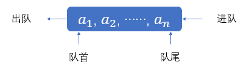
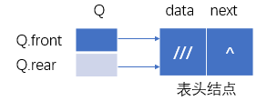
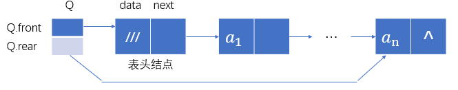
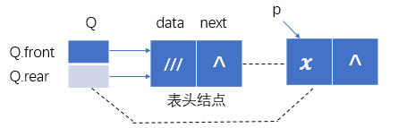
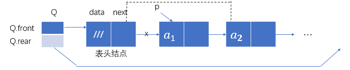
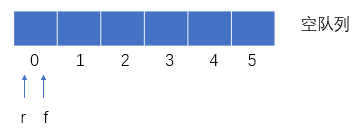
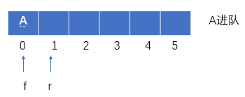
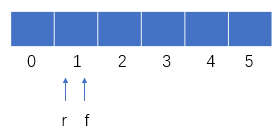
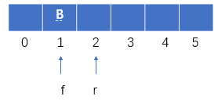

### 队列的相关概念

#### 定义和术语

队列：只允许在表的一端删除元素，在另一端插入元素的线性表；

空队列：不含元素的队列；

队首：队列中只允许删除元素的一端，head，front；

队尾：队列中只允许插入元素的一端，rear，tail；

队首元素：处于队首的元素；

队尾元素：处于队尾的元素；

进队：插入一个元素到队列中；

出队：从队列中删除一个元素。

####  先进先出

#### 队列及其操作

队列的进队和出队

将新元素插入到队尾，出队将队首元素删除



#### 队列的基本操作

``` C++
InitQueue(q);  //初始化，将q置为空队列
QueueEmpty(q);  //判断q是否为空队列
EnQueue(q,e);  //将e插入队列q的尾端
DeQueue(q,e);  //取走队列q的首元素，送e
GetHead(q,e);  //读取队列q的首元素，送e
QueueClear(q);  //置q为空队列
```

### 链式队列

#### 一般形式

`Q.front` 队首指针，指向表头结点

`Q.rear` 队尾指针，指向队尾结点

`Q.front->data`  不放元素

#### 空队列



#### 非空队列



#### 定义结点类型

- 存放元素的结点类型

``` C++
typedef struct Qnode
{
    ElemType data;
    struct Qnode *next;
}Qnode,*QueuePtr;
```

- 由头尾指针组成的结点类型

``` C++
typedef struct 
{
    Qnode *front; //头指针
    Qnode *rear; //尾指针
}LinkQueue; //链式队列类型
```

#### 生成空队列算法：初始化队列

``` C++
#define LENG sizeof(Qnode) //求解点所占单元数
LinkQueue InitQueue() //生成仅带表头结点的空队列
{
    LinkQueue Q; //说明变量Q
    Q.front=Q.rear=(QueuePtr)malloc(LENG); //生成表头结点
    Q.front->next=NULL; //表头结点的next为空指针
    return Q; //返回Q的值
}
```

##### 例子

``` C++
main()
{
    LinkQueue que;
    que=InitQueue();
    ...
}
```

#### （空队列时）插入新元素x



#### 插入新元素e的算法

``` C++
LinkQueue EnQueue(LinkQueue Q, ELemType e)
{
    Qnode *p; //说明变量p
    p=(Qnode *)malloc(LENG); //生成新元素结点
    p->data=e; //装入元素e
    p->next=NULL; //为队尾结点
    Q.rear->next=p; //插入
    Q.rear=p; //修改尾指针
    return Q;
}
```

##### 例：插入一个新元素10

``` C++
main()
{
    LinkQueue que;
    que=InitQueue();
    que=EnQueue(que,10);
}
```

#### 元素的删除

队列删除元素时都是删除队首元素

若原队列有2个或2个以上结点

执行：`Q.front->next=p->next;`



若原队列只有1个结点

执行`free(p); Q.rear=Q.front;


#### 链式队列的出队算法

``` C++
LinkQueue DelQueue(LinkQueue Q,Elemtype *e)
{
    Qnode *p; //说明变量p
    if(Q.front==Q.rear) //若原队列为空
    {
        printf("Empty queue");
        return Q;
    }
    p=Q.front->next; //p指向对头结点
    (*e)=p->data; //取出e指向它
    Q.front->next=p->next; //删除队头结点
    if(Q.rear==p) //若原队列只有1个结点
        Q.rear=Q.front;
    free(p);
    return Q;
}
```

### 顺序队列与“假溢出”

假设用一维数组Q[0...5]表示顺序队列

设f指向队头元素，r指向队尾元素的后一单元

1. 初始化后
   


2. A进队后



3. A出队后



4. B进队后



移动元素开销大

#### 方法二：将Q当循环表使用

当f=r时，如何分辨是空队列和满队列？

#### 解决方案：增加一个标识变量

方案二：还剩最后一个单元不使用，可避免满队列时出现的二义性。

即：进队前测试

若r+1=f，表明还剩最后一个单元，认为此时就是满队列

#### 定义队列的C类型

``` C++
#define MAXLENG 100
typedef struct
{
    ElemType elem[MAXLENG];
    int front,rear;
}SeQueue;
SeQueue Q;
```

#### 进队算法

假设Q表示顺序队列，头指针front指向队头元素，rear指向队尾元素的后一个空位，e为进队元素。

``` C++
int En_Queue(SeQueue &Q,ElemType e)
{
    if((Q.rear+1)%MAXLENG==Q.front) //若Q满，退出
        return ERROR;
    Q.elem[Q.rear]=e; //装入新元素e
    Q.rear++;
    Q.rear=Q.rear%MAXLENG; //循环队列
    return OK;
}
```

#### 出队算法

``` C++
int De_Queue(SeQueue &Q,ElemType &e)
{
    if(Q.front==Q.rear) //空队列，退出
        return ERROR;
    e=Q.elem[Q.front]; //取走头元素，送e
    Q.front=(Q.front+1)%MAXLENG;
    return OK;
}
```

提醒：f指向队首元素，r指向队尾元素后一单元。