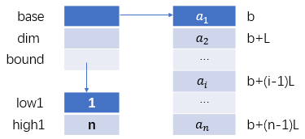
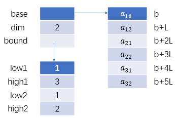
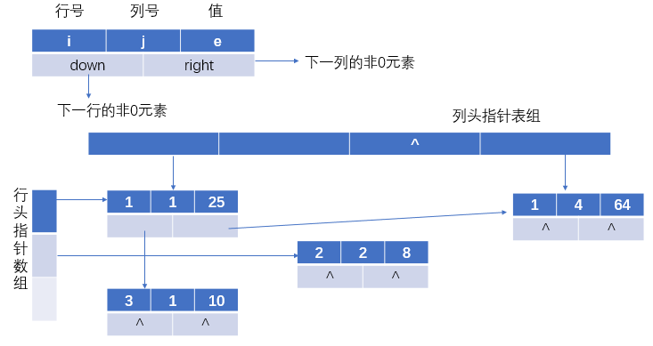

### 数组的定义

1. 一维数组：是一个定长线性表$(a_1,a_2,...,a_n)$
   
   记为：$A=(a_1,a_2,...,a_n)$

   其中：$a_i$为数据元素，$i$为下标/序号，$1\le i\le n$

2. 二维数组是一个定长线性表
   
   $A=(\alpha_1,\alpha_2,...,\alpha_m)$这里每个元素$\alpha_i$代表矩阵的一行

   $A=(\beta_1,\beta_2,...,\beta_n)$这里每个元素$\beta_j$代表矩阵的一列

$$
数组\begin{cases}
数据对象\\
数据关系\\
基本操作\\
\end{cases}
$$

### 数组的操作

``` C++
InitArray(&A,n,bound1,...,boundn); //创建一个n维数组，各维长度通过boundi表示
DestroyArray(&A); //销毁数组A
Value(A,&e,index1,...,indexn); //读取数组指定下标的元素值到e中
Assign(A,e,index1,...,indexn); //将e的值给指定下标的数组元素中
```

### 数组的顺序表示和实现

#### 数组的物理结构

因素：

1. 分配连续的存储单元成非连续的存储单元；
2. 保存全部数组元素成部分的数组元素。

#### 一维数组的顺序表示

一维数组$A=(a_1,a_2,...,a_n)$



一维数组数据元素$a_i$的地址计算公式

$LOC(i)=b+(i-1)L=LOC(1)+(i-1)L$

其中：$LOC(i)$为元素$a_i$的存储位置，b是连续存储单元首地址，L是一个数据元素所占的单元数。

#### 二维数组的顺序表示

步骤：

1. 计算需要分配多大的连续空间，才能保存所有的数据元素。

2. 存放方式，一种是逐行存放，称为行序优先。还有一种是逐列存放，我们也称为列序优先。

##### 以行序为主序的顺序存储方式

$$
    \begin{pmatrix}
    a_{11}&a_{12}\\
    a_{21}&a_{22}\\
    a_{31}&a_{32}\\    
    \end{pmatrix}
$$



$A_{m*n}$需要考虑：

1. 分配空间；明确分配多大连续空间。这里共需要开辟$m*n$个数据元素的连续空间。

2. 确定存放方式，首先以行序优先逐行存放。

3. 分析数据元素$a_{ij}$的计算空间。

当采用逐行存放方式时，前面有$i$行，每行有$n$个数据元素，共有$i*n$个数据元素。

而在第$i$行中，$a_{ij}$前面还需要存放$j$个数据元素。

这样在前面存放的数据元素的总个数是$i*n+j$。所以$a_{ij}$的地址计算公式为：

$$LOC(i,j)=b+(i*n+j)L=LOC(0,0)+(i*n+j)L$$

考虑列序优先，逐列存放时，前面有$j$列，每列有$m$个数据元素，共有$j*m$个数据元素。

而在第$j$列中，$a_{ij}$前面还需要存放$i$个数据元素。

这样在前面存放的数据元素的总个数是$j*m+i$。所以$a_{ij}$的地址计算公式为：

$$LOC(i,j)=b+(j*m+i)L=LOC(0,0)+(j*m+i)L$$

对任意一个数组元素$A[i_1,i_2,...,i_n]$，可得到行序优先的寻址方式为

$$LOC(i_1,i_2,...,i_n)=LOC(0,0)+(i_1*k_2*k_3...*k_n+i_2*k_3...*k_n+...+i_{n-1}*k_n+i_n)*L$$

### 特殊矩阵的压缩存储

#### n阶对称矩阵

$a_{ij}=a_{ji}$，$i\le m,j\le n$

下三角元素$a_{ij}$满足$i\ge j$

数据元素的个数$=1+2+...+n=n(n+1)/2$

假定以行序为主，顺序存储下三角元素到$SA[1...n(n+1)/2]$

1. 设$a_{ij}$在下三角，$i\ge j$

    $\because$第$1$~$i-1$行共有元素$1+2+3+...+(i-1)=i(i-1)/2$个

    第$i$行中，$a_{ij}$是第$j$个数据元素，共有$j$个元素

    $\therefore$$a_{ij}$的序号为：$k=i(i-1)/2+j$

2. 设$a_{ij}$在上三角，$i\lt j$

    $\because$上三角的$a_{ij}$等于下三角的$a_{ji}$

    下三角的$a_{ji}$的序号为$k=j(j-1)/2+i$，$i<j$

    $\therefore$上三角的$a_{ij}$的序号为$k=j(j-1)/2+i$，$i<j$

由1和2，任意$a_{ij}$在$SA$中的序号，为

$$
k= \begin{cases}
   i(i-1)/2+j, i\ge j\\
   j(j-1)/2+i, i<j\\
   \end{cases}
   或
A(i,j)=\begin{cases}
       SA[i(i-1)/2+j], i\ge j\\
       SA[j(j-1)/2+i], i<j\\
       \end{cases}   
$$

该公式称为在$SA$中的映象函数，下标转换公式

#### 三对角矩阵

除了对角的三条元素，其余为0

1. 元素$a_{ij}$在三对角的条件：$|i-j|\le1$；

2. 三对角的元素个数：$3n-2$

假定以行序优先，将三对角元素顺序存储到$SA[1...3n-2]$中

任意三对角元素$a_{ij}$，在$SA$中的序号：

$k=(3*(i-1)-i)+(j-i+2)=2i+j-2$

$$
A[i,j]=\begin{cases}
       SA[k], |i-j|\le1\\
       0, 其它\\
       \end{cases}
$$

### 稀疏矩阵的压缩存储

#### 三元组表

在实际应用中，常常会遇到一种矩阵，零元素很多，非零元素很少，且非零元素在矩阵中的位置没有特定的规律，我们称这种矩阵为稀疏矩阵。

稀疏矩阵没有一个明确的定义，只是从形式上看，非零元素的个数的元素总数的比例低于某特定的定位。

由于非零元素很少，所以只需保存这些非零元素，没有保存的都是零元素。为了标明每个非零元素在矩阵中的位置，我们可以以（行，列，值）形式的三元组形式来保存非零元素。

所有的非零元素的三元组序列加上行数和列数称为三元组表。

$$(i,j,e)$$

#### 三元组顺序表

我们首先考虑的是分配连续的存储空间，保存稀疏矩阵中的三元组表，这种存储结构称之为三元组顺序表。

在三元组顺序表中，首先需要的是一个足够大的三元组数组空间，将非零元素的三元组按行序优先的次序保存在数组中，再就是矩阵的行数，列数和非零元素的个数。

这样三元组顺序表就能唯一地确定稀疏矩阵，逻辑上和物理上就对应起来了。

|   1   |   2   |  33   |
| :---: | :---: | :---: |
|   1   |   3   |   9   |
|   3   |   1   |  10   |
|   3   |   6   |  36   |
|   4   |   3   |  16   |
|   5   |   2   |  28   |
|   6   |   4   |  37   |
|  ///  |  ///  |  ///  |

行数(mu):6

列数(nu):7

非零元(tu):7

##### 数据类型

1. 假定非零元素的个数最大值能达到10000，定义常量`MAXSIZE=10000;`

2. 定义三元组的结构类型triple；包括非零元素的行位置，列位置，元素值这三个属性。

3. 定义三元组顺序表的结构类型TSMatrix。包括大小为MAXSIZE的三元组数组，行数，列数和非零元素个数几个属性。

``` C++
#define MAXSIZE 10000
typedef struct
{
    int i,j; //非零元行，列下标
    ElemType e;
}Triple; //定义三元组
typedef struct
{
    Triple data[MAXSIZE+1];
    int mu,nu,tu;
}TSMatrix; //定义三元组表
TSMatrix M;
```

### 十字链表



我们把这种物理结构称为十字链表。非常形象地表示了每个非零数据元素的水平方向的关系，行关系，以及垂直方向的关系，列关系。这两种关系十字交叉，所以称为十字链表。

``` C++
typedef struct OLNode //三元组结点定义
{
    int i,j; //非零元素行，列位置
    ElemType e;
    struct OLNode *right, *down;
}OLNode,*OLink;
typedef struct //十字链表类型定义
{
    OLink *rhead,*chead; //行列头指针数组
    int mu,nu,tu; //稀疏矩阵的行数，列数和非零元个数
}CrossList;
```

### 稀疏矩阵的转置算法

#### 算法1：

``` C++
void TransMatrix1(TSMatrix M,TSMatrix &T)
{
    T.mu=M.nu;
    T.nu=M.mu;
    T.tu=M.tu;
    if(T.tu)
    {
        q=1; //指示向T写时的位置
        for(col=1;col<=M.nu;++col) //扫描M的三元组表M.nu次
            for(p=1;p<=M.tu;++p) //扫描M的长度为M.tu的三元表
                if(M.data[p].j==col) //找到一个符合条件的三元组
                {
                    T.data[q].i=M.data[p].j;
                    T.data[q].j=M.data[p].i;
                    T.data[q].e=M.data[p].e;
                    q++;
                }
    }
}
```

时间复杂度：$O(M.mu*M.tu)$

#### 算法2：改进算法

``` C++
void TransMatrix2(TSMatrix M,TSMatrix &T)
{
    T.mu=M.nu;
    T.nu=M.mu;
    T.tu=M.tu;
    if(T.tu)
    {
        for(col=1;col<=M.nu;col++)
            num[col]=0;
        for(t=1;t<=M.tu;t++)
            ++num[M.data[t].j];
        cpot[1]=1; //计算数组cpot
        for(col=2;col<=M.nu;col++)
            cpot[col]=cpot[col-1]+num[col-1];
        for(p=1;p<=M.tu;++p) //扫描M三元组表
        {
            col=M.data[p].j; //确定M当前元素列号
            q=cpot[col];
            T.data[q].j=M.data[p].i;
            T.data[q].i=M.data[p].j;
            T.data[q].e=M.data[p].e;
            ++cpot[col]; //修改T的当前行下一元素存放位置
        }
    }
}
```