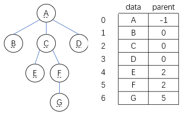
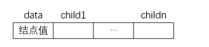
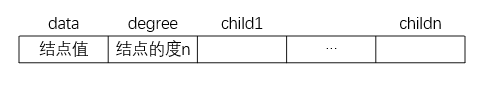
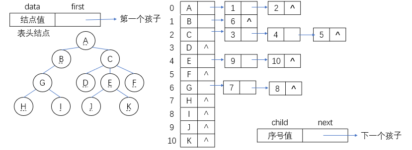
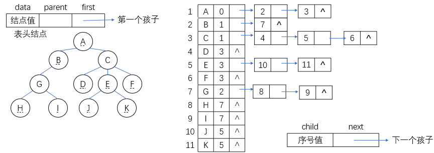
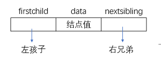

### 定义和术语

#### 树(tree)

树是$n(n\ge 0)$个结点的有限集$T$，

当$n=0$时，$T$为空树；

当$n>0$时，有且只有一个称为$T$的根的结点，

当$n>1$时，余下的结点分为$m(m>0)$个互不相关的有限集$T_1,T_2,...,T_m$，每个$T_i(1\le i \le m)$也是一棵树，且称为根的子树。


#### 结点的度(degree)

结点的子树数目。

#### 树的度

树中各结点的度的最大值。

#### $n$度树

度为$n$的树。

#### 叶子(终端结点)

度为$0$的结点。

#### 分支结点(非终端结点，非叶子)

度不为$0$的结点。

#### 双亲(父母,parent)和孩子(儿子,child)

若结点$C$是结点$P$的子树的根，称$P$是$C$的双亲，$C$是$P$的孩子。

#### 结点的层(level)

规定树$T$的根的层为$1$，其余任一结点的层等于其双亲的层加$1$。

#### 树的深度(depth,高度)

树中各结点的层的最大值。

#### 兄弟(sibling)

同一双亲的结点之间互为兄弟。

#### 堂兄弟

同一层号的结点互为堂兄弟。

#### 祖先

从树根到某结点所经分支上的所有结点为该结点的祖先。

#### 子孙

一个结点的所有子树的结点为该结点的子孙。

#### 有序树

若任一结点的各棵子树，规定从左至右是有次序的，即不能互换位置，则称该树为有序树。

#### 无序树

若任一结点的各棵子树，规定从左至右是无次序的，能互换位置，则称该树为无序树。

#### 森林

$m(m\ge 0)$棵互不相关的树的集合。

任何一棵非空树可以表示为一个元且$Tree=(root,F)$，其中$root$为根结点。

### 树的操作

#### 查找类

``` C++
Root(T); //求树的根结点
Value(T,cur_e); //求当前结点的元素值
Parent(T,cur_e); //求当前结点的双亲结点
LeftChild(T,cur_e); //求当前结点的最左孩子
RightSibling(T,cur_e); //求当前结点的右兄弟
TreeEmpty(T); //判定树是否为空树
TreeDepth(T); //求树的深度
TaverseTree(T,visit()); //遍历
```

#### 插入类

``` C++
InitTree(&T); //初始化空树
CreatTree(&T,definition); //按定义构造树
Assign(T,cur_e,value); //给当前结点赋值
InsertChild(&T,$p,i,c); //将以C为根的树插入为结点p的第i棵子树
```

#### 删除类

```C++
ClearTree(&T); //将树清空
DestroyTree(&T); //销毁树的结构
DeleteChlid(&T,&p,i); //删除结点p的第i棵子树
```

### 树结构的特点

|              线性结构              |               树型结构               |
| :--------------------------------: | :----------------------------------: |
|      第一个数据元素（无前驱）      |           根结点（无前驱）           |
|     最后一个数据元素（无后继）     |       多个叶子结点（无“后继”）       |
| 其它数据元素（一个前驱，一个后继） | 其它数据元素（一个前驱，多个“后继”） |

### 树的存储结构

#### 双亲表示法/顺序表示法



C语言的类型描述：

```C++
#define MAX_TREE_SIZE 100
//结点结构
typedef struct PTNode
{
    TElemType data;
    int parent; //双亲位置域
}PTNode;
//树结构
typedef struct
{
    PTNode nodes[MAX_TREE_SIZE];
    int r,n; //根节点的位置和结点个数
}PTree;
```

#### 孩子表示法/链接表表示法

1. 固定大小的结点格式，设树$T$的度为$n$
   


2. 非固定大小的结点格式
   


#### 孩子链表表示法/单链表表示法



#### 带双亲的孩子链表表示法



#### 孩子兄弟表示法/二叉链表



```C++
typedef struct CSNode
{
    ElemType data;
    struct CSNode *firstchild,*nextsibling;
}CSNode,*CSTree;
```

### 树与二叉树的转换

#### 树转换成二叉树

1. 加线：在树兄弟结点之间依次加一连线。

2. 抹线：对每个结点，除了其左孩子（第一个孩子）外，去掉其与其余孩子之间的关系。

3. 旋转：以树的根结点为轴心，将整树顺时针旋转45°

转换之后的二叉树与其对应的二叉链表一样，根结点右子树一定为空，原来树中兄弟关系转换成了二叉树中双亲与右孩子的关系。

#### 二叉树转换成树

1. 加线：若p结点是双亲结点的左孩子，则将p的右孩子，右孩子的右孩子，以及沿分支找到的所有右孩子，都与p的双亲用线连起来。

2. 抹线：抹掉原二叉树中双亲与右孩子之间的连线。

3. 调整：将结点按层次排列，形成树结构。

#### 森林转换成二叉树

1. 将各棵树分别转换成二叉树。

2. 将每棵二叉树的根用线相连。

3. 以第一棵树根结点为二叉树的根，再以根结点为轴心，顺时针旋转，构成二叉树型结构。

#### 二叉树转换成森林

1. 第一步，通过抹线进行分割：将二叉树中根结点与其右孩子连线，及沿右分支搜索到的所有右孩子间连线全部抹掉，使之变成孤立的二叉树。

2. 第二步，利用二叉树转换成树的的方法分别将孤立的二叉树还原成树，从而形成森林。

### 树的遍历

树的遍历要规定根与子树的访问次序，可以分成先根遍历与后根遍历两种遍历规则。

先根遍历的具体规则为：

若树为空，则空操作；否则，树非空时，按以下两步处理，

1. 首先，访问树的根结点；

2. 然后依次先根遍历每棵子树。

后根遍历的具体规则如下：

若树为空，则空操作；否则，树非空时按下列两部进行：

1. 首先依次后根遍历每棵子树；

2. 然后访问树的根结点。

### 森林的遍历

先序遍历森林（相当于对对应的二叉树进行先序遍历）

若森林为空，则空操作；否则

1. 访问第一棵树的根结点；

2. 先序遍历第一棵树中根结点的子树森林；

3. 先序遍历除去第一棵树后余下的树构成的森林。

森林中序遍历的递归定义，描述如下：

若森林为空，则空操作，否则对于非空森林，执行以下三步：

1. 首先中序遍历第一棵树根结点的子树森林；

2. 然后访问第一棵树的根结点；

3. 接着中序遍历除第一棵树后余下的树构成的森林。

### 树的遍历和二叉树遍历的对应关系

|    树    |   森林   |  二叉树  |
| :------: | :------: | :------: |
| 先根遍历 | 先序遍历 | 先序遍历 |
| 后根遍历 | 中序遍历 | 中序遍历 |

