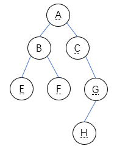
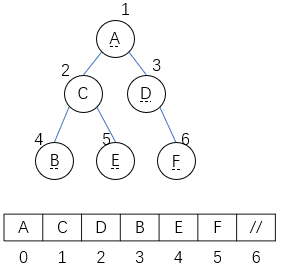
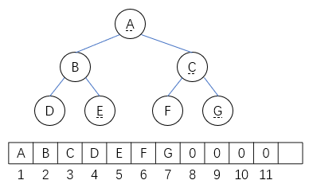
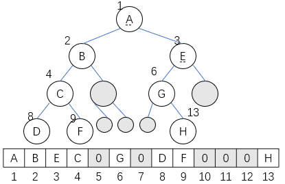
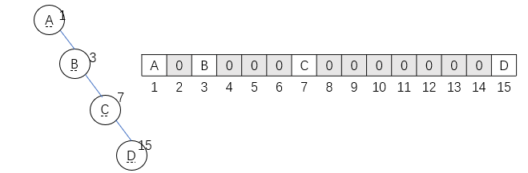
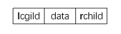
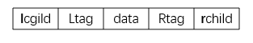

### 定义和术语

#### 二叉树的递归定义

二叉树是$n$个结点的有限集，可分为两种情形：

1. 如果$n=0$；那么它就是一棵空二叉树；

2. 如果$n>0$，则它包含一个根结点，而剩下的结点分为两个不相交的子集，分别构成根结点的左子树和右子树。



特点：

- 每个结点至多有二棵子树（即不存在度大于$2$的结点）；
- 二叉树的子树有左、右之分，且其次序不能任意颠倒。

### 二叉树的操作

#### 二叉树的基本操作

1. 置$T$为空二叉树：$T=\{ \}$
2. 销毁二叉树$T$
3. 生成二叉树$T$：生成哈夫曼树、二叉排序树、平衡二叉树、堆
4. 遍历二叉树$T$:

    按某种规则访问$T$的每一个结点一次且仅一次的过程。
5. 二叉树$\leftarrow\rightarrow$树
6. 二叉树$\rightarrow$平衡二叉树
7. 求结点的层号
8. 求结点的度
9. 求二叉树T的深度
10. 插入一个结点
11. 删除一个结点
12. 求二叉树$T$的叶子/非叶子

#### 查找类

``` C++
Root(T);
Value(T,e);
Parent(T,e);
LeftChild(T,e);
RightChild(T,e);
LeftSibling(T,e);
RightSibling(T,e);
BiTreeEmpty(T);
BiTreeDepth(T;
```
#### 插入类

``` C++
InitBiTree(&T);
Assign(T,&e,value);
CreateBiTree(&T,definition);
InsertChild(T,p.LR,c);
```
#### 删除类
``` C++
ClearBiTree(&T);
DestroyBiTree(&T);
DeleteChild(T,p,LR);
```

### 二叉树的性质和特殊二叉树

性质1.在二叉树的第$i$层上至多有$2^{i-1}$个结点$(i\ge1)$。

性质2.深度为$k$的二叉树最多有$2^k-1$个结点。满二叉树——深度为$k$且有$2^k-1$个结点的二叉树。满二叉树有以下特点：

1. 每一层上结点数都达到最大；叶子结点都在第$k$层。

2. 度为$1$的结点$n_1=0$。

3. $n$个结点的满二叉树的深度$=log_2(n+1)$。

性质3.二叉树中，终端结点数$n_0$与度为$2$的结点数$n_2$，有如下关系：$n_0=n_2+1$。

性质4.结点数为$n$的完全二叉树，其深度为：$[log_2n]+1=[log_2(n+1)]$。

性质5.若对含$n$个结点的完全二叉树从上到下且从左至右进行$1$至$n$的编号，则对完全二叉树中任意一个编号为$i$的结点：

1. 若$i=1$，则该结点是二叉树的根，无双亲，否则，编号为$[i/2]$的结点为其双亲结点；

2. 若$2i>n$，则该结点无左孩子，否则，编号为$2i$的结点为其左孩子结点；

3. 若$2i+1>n$，则该结点无右孩子结点，否则，编号为$2i+1$的结点为其右孩子结点。

#### 顺序编号的满二叉树

设满二叉树有$n$个结点，编号为$1,2,...,n$

- 左小孩为偶数，右小孩为奇数；
- 结点$i$的左小孩是$2i,2i\le n$；

    结点$i$的右小孩是$2i+1,2i+1\le n$；
    
    结点$i$的双亲是$[i/2],2\le i\le n$；
- 结点$i$的层号$=[log_2i]+1=[log_2(i+1)],1\le i\le n$。

#### 完全二叉树 

深度为$k$有$n$个结点的二叉树，当且仅当每一个结点都与同深度的满二叉树中编号$1$至$n$的结点一一对应，则称之为完全二叉树（或称为顺序二叉树）。

深度为$k$的完全二叉树的特点或性质：

1. 任意结点$i$，其左右子树的深度分别表示为$Lh_i$与$Rh_i$，则$Lh_i-Rh_i$等于$0$或$1$，其叶结点只可能出现在层次最大或次最大的两层上。

2. 完全二叉树结点数$n$满足$2^{k-1}<n\le2^k-1$。

### 二叉树的存储结构

#### 顺序结构

##### 使用一堆数组存储完全二叉树：

``` C++
#define MAX_TREE_SIZE 100 //二叉树的最大结点数
typedef TElemType SqBiTree[MAX_TREE_SIZE]; //0号单元存储根结点
SqBiTree bi;
```



顺序存储特点：用一组地址连续的存储单元，以层序顺序存放二叉树的数元素，结点的相对位置蕴含着结点之间的关系。

完全二叉树


若数组从“1”编址，对于$i=3$，$bt[i]$的双亲为$3/2=1$，即在$bt[1]中；其左孩子在$bt[2i]=bt[6]$中；其右孩子$bt[2i+1]=bt[7]$中。

一般二叉树

按完全二叉树形式存储，没结点处用$0$表示，表示“虚结点”。



右单枝树



缺点：浪费空间；插入、删除不便。

深度为$k$的二叉树，需长度为$2^k-1$的一堆数组。若是右单枝树，空间利用率为：
$$\alpha=\frac{k}{2^k-1}$$

#### 链式存储

##### 二叉链表



``` C++
typedef struct BiTNode //结点结构
{
    TElemType data;
    struct BiTNode *lchild,*rchild; //左右孩子指针
}BiTNode,*BiTree;
```

性质6.含有$n$个结点的二叉链表中，有$n+1$个空链域。

### 遍历二叉树

遍历是按某种规则访问二叉树的每一个结点一次仅一次的过程。

“遍历”是任何类型均有的操作，对线性结构而言，只有一条搜索路径（因为每个结点均只有一个后继）。

二叉树是非线性结构，每个结点可能有两个后继，则存在如何遍历即按什么样的搜索路径遍历的问题。

一次遍历后，使树中结点的非线性排列，按访问的先后顺序变为某种线性排列。

遍历是树结构插入、删除、修改、查找等运算的基础。

设：$D$——访问根节点，输出根结点；$L$——递归遍历左二叉树；$R$——递归遍历右二叉树。

遍历规则（方案）：

- 先左后右

    $DLR$——先序遍历（先根，preorder）
    
    $LDR$——中序遍历（中根，inorder）

    $LRD$——后序遍历（后根，postorder）

- 先右后左

    $DRL$——逆先序遍历

    $RDL$——逆中序遍历

    $RLD$——逆后序遍历

#### 先序遍历

先序遍历二叉树递归定义：

若二叉树为空，则遍历结束；否则，执行下列步骤：

1. 访问根结点；

2. 先序遍历根的左子树；

3. 先序遍历根的右子树。

先序遍历递归算法（基于二叉链表）：

``` C++
typedef struct BiTNode *BiTree; //结点指针类型
status PreOrderTraverse(BiTree T, status(*visit)(TELemType &e))
{
    if(T)
    {
        vist(T->data); //访问结点
        PreOrderTraverse(T->lchild,visit); //遍历左子树
        PreOrderTraverse(T->rchild,visit); //遍历右子树
    }
}
```

#### 中序遍历

中序遍历二叉树递归定义：

若二叉树为空，则遍历结束；否则，执行下列步骤：

1. 中序遍历根的左子树；

2. 访问根结点；

3. 中序遍历根的右子树。

中序遍历递归算法：

``` C++
typedef struct BiTNode *BiTree; //结点指针类型
void InOrderTraverse(BiTree T) //T是指向二叉链表根结点的指针
{
    if(T)
    {
        InOrderTraverse(T->lchild); //递归访问左子树
        printf("%c",T->data); //访问结点
        InOrderTraverse(T->rchild); //递归访问右子树
    }
    return;
}
```

#### 后序遍历

后序遍历二叉树递归定义：

若二叉树为空，则遍历结束；否则，执行以下步骤：

1. 后序遍历根的左子树；

2. 后序遍历根的右子树；

3. 访问根结点。

后序遍历递归算法：

``` C++
typedef struct BiTNode *BiTree; //结点指针类型
void PostOrderTraverse(BiTree T) //T是指向二叉链表根结点的指针
{
    if(T)
    {
        PostOrderTraverse(T->lchild); //递归访问左子树
        PostOrderTraverse(T->rchild); //递归访问右子树
        printf("%c",T->data); //visit(T->data)，访问结点
    }
    return;
}
```

#### 非递归算法（中序遍历）

- 递归算法简明精炼，但效率较低；
- 某些高级语言不支持递归；
- 非递归算法思想：
  
    1. 设置栈$S$存放所经过的根节点指针信息；初始化$S$；
    
    2. 遇到根节点并不访问，而是入栈；
    
    3. 中序遍历它的左子树；左子树遍历结束后，将根结点指针退栈，并访问根结点；然后中序遍历它的右子树。
    
    4. 当需要退栈时，如果栈为空则结束。

``` C++
status InOrderTraverse(BiTree T, status(*visit)(TElemType &e))
{   //中序遍历非递归算法，s为存储二叉树结点的指针栈
    InitStacks(S);
    push(S,T); //根指针进栈（指针也进栈）
    while(!StackEmpty(S))
    {
        while(GetTop(S,p)&&p)
            push(S,p->lchild); //向左走到尽头
        pop(S,p); //空指针退栈
        if(!StackEmpty(S)) //访问结点与其右子树
        {
            pop(S,p);
            visit(p->data);
            push(S,p->rchild);
        }
    }
    return OK;
}
```

根先进栈，左孩子紧随其后进栈，右孩子在根出栈后入账。

每个结点都进一次和出一次栈，且总访问栈顶元素，故时间复杂度为$O(n)$。最坏情况时，空间复杂度为$O(n)$。

#### 层序遍历算法

- 按从上往下逐层，同层从左至右的次序访问各结点；

- 访问根之后，通过根访问其左孩子，然后右孩子；

- 采用队列暂存没访问过的结点。

循环处理的基本思路是：

若队非空，队头结点出队，并访问该结点；若该节点左右孩子非空，则依次进队。

``` C++
void LayerOrder(BiTree T)
{
    InitQueue(Q); //初始化队列
    if(T)
        EnQueue(Q,T); //T非空则入队
    while(!QueueEmpty(Q))
    {
        DeQueue(Q,&p); //队首结点出队（送入p）
        visit(p); //出队后即刻访问该结点
        if(p->lchild)
            EnQueue(Q,p->lchild); //p的左孩子入队
        if(p->rchild)
            EnQueue(Q,p->rchild); //p的右孩子入队
    }
}
```

#### 二叉树的遍历应用

##### 建立二叉树的存储结构

``` C++
status CreatBiTree(BiTree &T)
{   //按先序次序输入二叉树结点的值（空格符表空树），构造其二叉链表
    scanf(&ch);
    if(ch==' ') T+NULL;
    else 
    {
        if(!(T=(BiTNode*)malloc(sizeof(BiTNode))))
            exit(OVERFLOW);
        T->data=ch; //生成根结点
        CreateBiTree(T->lchild); //构造左子树
        CreateBiTree(T->rchild); //构造右子树
    }
    return OK;
}
```

##### 求二叉树的深度（后序遍历）

``` C++
int Depth(BiTree T)
{
    if(!T)
        depthval=0;
    else
    {
        depthLeft=Depth(T->lchild);
        depthRight=Depth(T->rchild);
        depthval=1+(depthLeft>depthRight?depthLeft:depthRight);
    }
    return depthval;
}
```

### 线索二叉树

遍历二叉树是按某种规则将非线性结构的二叉树结点线性化。

- 遍历二叉树可得到结点的一个线性序列，在线性序列中，就存在结点的前驱和后继，但是在二叉链表上只能找到结点的左孩子、右孩子。

- 二叉树结点中没有相应前驱和后继的信息。

- $n$个结点的二叉链表：有$n*2$个指针域，使用：$n-1$个指针，除根以外，每个结点被一个指针指向

- 空指针域数;$n*2-(n-1)=n+1$

- 线索二叉树：利用$n+1$个空链域存放结点的前驱和后继信息。

- 指向先序列中的“前驱”和“后继”的指针，称作“线索”。

#### 结点结构

在二叉链表中增加$Ltag$和$Rtag$两个标志域。



考虑结点的左子树

- 若有，则左链域$lchild$指示其左孩子（$Ltag=0$）；
- 否则，令左链域指示其前驱（$Ltag=1$）；

考虑结点的右子树

- 若有，则右链域$rchild$指示其左孩子（$Rtag=0$）；
- 否则，令右链域指示其前驱（$Rtag=1$）；

#### 整体结构

- 增设一个头结点，令其$lchild$指向二叉树的根节点，$Ltag=0$、$Rtag=1$；
- 并将该结点作为遍历访问的第一个结点的前驱和最后一个结点的后继；
- 最后用头指针指示该头结点。

#### 空二叉树的线索链表

只有一个头结点，其$Ltag=0$、$Rtag=1$；$lchild$与$rchild$都指向头结点自身。

#### 线索链表的类型描述

``` C++
typedef enum
{
    Link,Thread
}PointerTag; //Link==0：指针，Thread==1，线索
typedef struct BiThrNode
{
    TElemType data;
    struct BiThrNode *lchild,*rchild; //左右指针
    PointerTag Ltag,Rtag; //左右标志
}BiThrNode, *BiThrTree;
```

#### 线索链表与线索二叉树的概念

- 称这种$BiThrNode$结点结构构成的二叉链表为二叉树的线索链表；
- 其中指示前驱和后继的链域称为线索；
- 其加上线索的二叉树称为线索二叉树；
- 对二叉树以某规则遍历使其变为线索二叉树的过程称为线索化；

    按中序遍历得到的线索二叉树称为中序线索二叉树；
    
    按先序遍历得到的线索二叉树称为先序线索二叉树；

    按后序遍历得到的线索二叉树称为后序线索二叉树；

#### 线索链表的遍历算法

中序线索二叉树遍历步骤

1. 设置一个搜索指针`p`；
2. 先寻找中序遍历之首结点（即最左下角结点），当`LTag=0`时（表示有左孩子），`p=p->lchild`；直到`LTag=1`（无左孩子，已到最左下角），首先访问`p->data`；
3. 接着进入该结点的右子树，检查`RTag`和`p->rchild`；
    
    ①. 若该结点的`RTag=1`（表示有后继线索），则`p=p->rchild`；访问`p->data`；并重复①，直到后继结点的`RTag=0`；
    
    ②. 当`RTag=0`时（表示有右孩子），则应从该结点的右孩子开始（`p=p->rchild`）查找左下角的子孙结点；即重复2.

主要规则是：有后继找后继，无后继找右子树的最左子孙。

``` C++
void InOrderTraverse_Thr(BiThrTree T,void(*visit)(TElemType e))
{
    p=T->lchild; //p指向根结点
    while(p!=T) //空树或遍历结束时，p==T
    {
        while(p->LTag==Link)
            p=p->lchild; //第一个结点
        if(!visit(p->data))
            return ERROR; //访问其左子树为空的结点
        while(p->RTag==Thread&&p->rchild!=T)
        {
            p=p->rchild;
            visit(p->data);
        } //访问后继结点
        p=p->rchild; //处理其右子树
    }
}
```

### 最优二叉树（Huffman树）

路径长度:从树中一个结点到另一个结点之间的分支构成这两个结点之间的路径，路径上的分支数目称做路径长度。

树的路径长度：从树根到每一结点的路径长度之和。

- 当$n$个结点的二叉树为完全二叉树时，$PL(T)$具有最小值

- 当$n$个结点的二叉树为单枝树时，$PL(T)$具有最大值

树或二叉树$T$的带权路径长度：每个叶子的权与根到该叶子的路径长度的乘积之和，记作$WPL(T)$。

$$WPL=\sum^n_{k-1}w_kl_k$$

其中：$n$——树$T$的叶子数目；$w_k$——叶子$k$的权；$l_k$——树$T$的根到叶子$k$的路径长度。

在具有$n$个相同叶子的各二叉树中，$WPL$最小的二叉树。称之为Huffman树或者最优二叉树。

哈夫曼树的几点特征：

1. 完全二叉树并不一定是Huffman树。
2. 在哈夫曼树中，权值大的结点离根近。
3. 哈夫曼树不唯一，但带权路径长度$WPL$一定相等。

#### Huffman算法

1. 以权值分别为$W_1,W_2,...,W_n$的n个结点，构成$n$棵二叉树$T_1,T_2,...,T_n$，并组成森林$F=\{T_1,T_2,...,T_n\}$，每棵二叉树$T_i$仅有一个权值为$W_i$的根结点；

2. 在$F$中选取两棵结点权值最小的树作为左右子树构造一棵新二叉树，并且置新二叉树根结点权值为左右子树上根结点的权值之和。根结点的权值=左右孩子权值之和，叶结点的权值=$W_i$。

3. 从$F$中删除这两棵二叉树，同时将新二叉树加入到$F$中；

4. 重复2，3直到$F$中只含一棵二叉树为止（这棵就是Huffman树）。

#### 哈夫曼编码/最小亢余码

能按字符的使用频率，使文本代码的总长度具有最小值。

特点：任一编码不是其它编码的前缀。

Huffman树和编码的特点：

1. 哈夫曼树中没有度为1的结点。因此若哈夫曼树有$n$个叶子结点，则其共有$2n-1$个结点。
2. Huffman编码时是从叶子走到根；而译码时又要从根走到叶子，因此每个结点需要增开双亲指针分量。

```C++
typedef struct
{
    unsigned int weight; //权值分量（可放大取整）
    unsigned int parent,lchild,rchild; //双亲和孩子分量
}HTNode,*HuffmanTree; //用动态数组存储Huffman树
typedef char **HuffmanCode; //动态数组存储Huffman编码表
```
