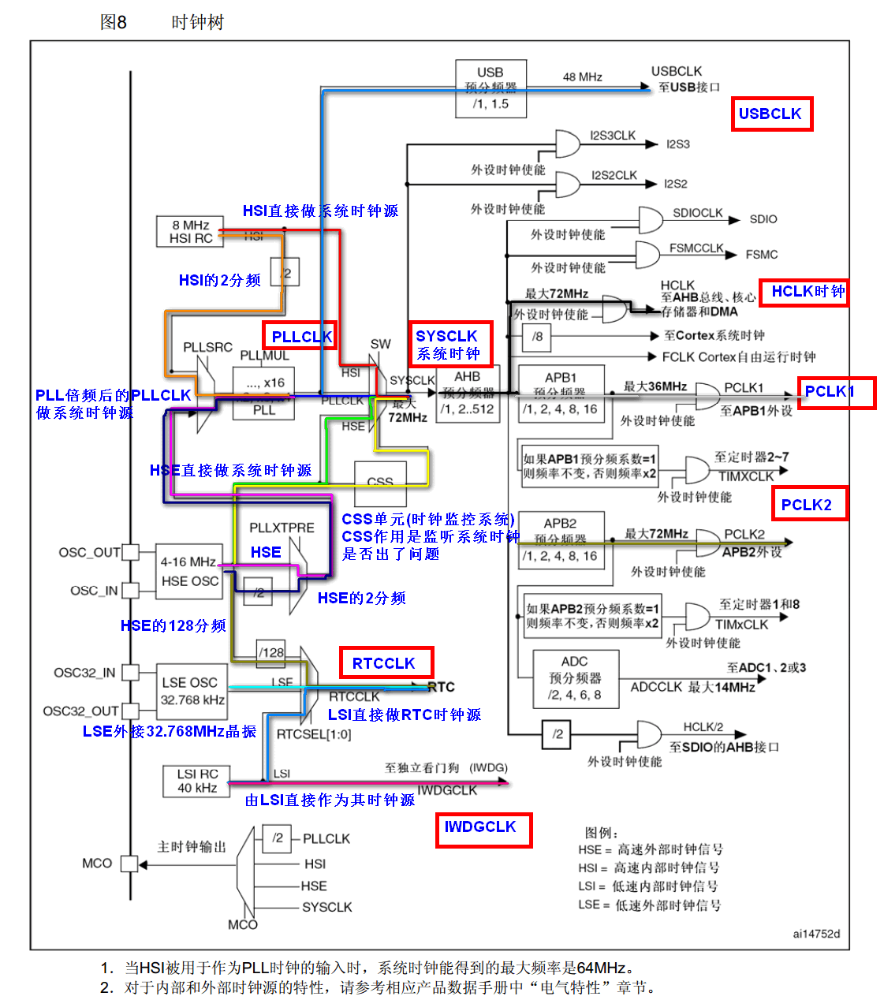
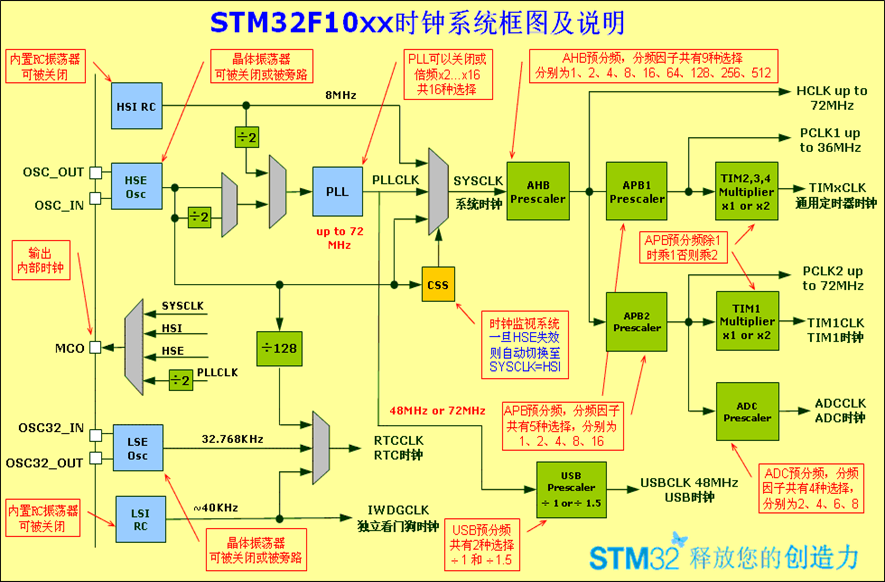
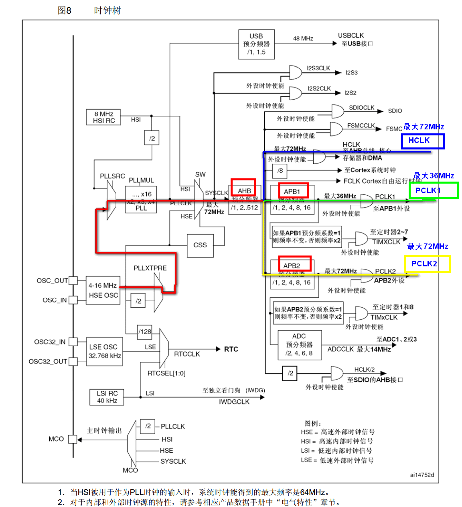

本文在[STM32开发——时钟详解](https://blog.csdn.net/qq_29350001/article/details/81558649)做了一定修改。

## 一、时钟系统框图



## 二、时钟系统



1. STM32 有5个时钟源:HSI、HSE、LSI、LSE、PLL。

     ①、HSI是高速内部时钟，RC振荡器，频率为8MHz，精度不高。
    
     ②、HSE是高速外部时钟，可接石英/陶瓷谐振器，或者接外部时钟源，频率范围为4MHz~16MHz。
    
     ③、LSI是低速内部时钟，RC振荡器，频率为40kHz，提供低功耗时钟。　
    
     ④、LSE是低速外部时钟，接频率为32.768kHz的石英晶体。
    
     ⑤、PLL为锁相环倍频输出，其时钟输入源可选择为HSI/2、HSE或者HSE/2。倍频可选择为2~16倍，但是其输出频率最大不得超过72MHz。

2. 系统时钟SYSCLK可来源于三个时钟源：
        
     ①、HSI振荡器时钟
    
     ②、HSE振荡器时钟
    
     ③、PLL时钟
     
3. STM32可以选择一个时钟信号输出到MCO脚(PA8)上，可以选择为PLL输出的2分频、HSI、HSE、或者系统时钟。
   
4. 任何一个外设在使用之前，必须首先使能其相应的时钟。

### 几个重要的时钟

- SYSCLK(系统时钟) 
- AHB总线时钟
- APB1总线时钟(低速): 速度最高36MHz
- APB2总线时钟(高速): 速度最高72MHz
- PLL时钟


## 三、RCC相关配置寄存器

``` C
/** 
          * @brief Reset and Clock Control
          */
        typedef struct
        {
          __IO uint32_t CR;           // HSI,HSE,CSS,PLL等的使能和就绪标志位 
          __IO uint32_t CFGR;         // PLL等的时钟源选择，分频系数设定
          __IO uint32_t CIR;          // 清除/使能 时钟就绪中断
          __IO uint32_t APB2RSTR;     // APB2线上外设复位寄存器
          __IO uint32_t APB1RSTR;     // APB1线上外设复位寄存器
          __IO uint32_t AHBENR;       // DMA，SDIO等时钟使能
          __IO uint32_t APB2ENR;      // APB2线上外设时钟使能
          __IO uint32_t APB1ENR;      // APB1线上外设时钟使能
          __IO uint32_t BDCR;         // 备份域控制寄存器
          __IO uint32_t CSR;          // 控制状态寄存器

        #ifdef STM32F10X_CL  
          __IO uint32_t AHBRSTR;
          __IO uint32_t CFGR2;
        #endif /* STM32F10X_CL */ 

        #if defined (STM32F10X_LD_VL) || defined (STM32F10X_MD_VL) || defined (STM32F10X_HD_VL)   
          uint32_t RESERVED0;
          __IO uint32_t CFGR2;
        #endif /* STM32F10X_LD_VL || STM32F10X_MD_VL || STM32F10X_HD_VL */ 
        } RCC_TypeDef;

```

## 四、RCC相关头文件和固件库源文件

所在文件：stm32f10x_rcc.c

### 时钟使能配置:

``` C
     RCC_LSEConfig() 、RCC_HSEConfig()、
     RCC_HSICmd() 、 RCC_LSICmd() 、 RCC_PLLCmd() ……
```

### 时钟源相关配置：

``` C
     RCC_PLLConfig ()、 RCC_SYSCLKConfig() 、
     RCC_RTCCLKConfig() …
```

### 分频系数选择配置：

``` C
      RCC_HCLKConfig() 、 RCC_PCLK1Config() 、 RCC_PCLK2Config()…
```

### 外设时钟使能：

``` C
     RCC_APB1PeriphClockCmd():  //APB1线上外设时钟使能
     RCC_APB2PeriphClockCmd();  //APB2线上外设时钟使能
     RCC_AHBPeriphClockCmd();   //AHB线上外设时钟使能
```

### 其他外设时钟配置：

``` C
    RCC_ADCCLKConfig ();  RCC_RTCCLKConfig();
```

### 状态参数获取参数：

``` C
     RCC_GetClocksFreq();
     RCC_GetSYSCLKSource();
     RCC_GetFlagStatus()
```


### RCC中断相关函数 :

``` C
    RCC_ITConfig() 、 RCC_GetITStatus() 、 RCC_ClearITPendingBit()…
```

## 五、系统时钟初始化函数

系统时钟初始化函数：`SystemInit();`

### 使用V3.5版本的库函数，该函数在系统启动之后会自动调用：


``` ASM
; Reset handler
Reset_Handler    PROC
                 EXPORT  Reset_Handler             [WEAK]
        IMPORT  SystemInit
        IMPORT  __main
                 LDR     R0, =SystemInit
                 BLX     R0
                 LDR     R0, =__main
                 BX      R0
                 ENDP
```

系统复位后先执行SystemInit,再执行main函数
　通过修改SystemInit函数名称,可以自定义系统初始化过程

### 在system_stm32f10x.c文件中找到SystemInit(void)源码:

``` C
/**
  * @brief  Setup the microcontroller system
  *         Initialize the Embedded Flash Interface, the PLL and update the
  *         SystemCoreClock variable.
  * @note   This function should be used only after reset.
  * @param  None
  * @retval None
  */
void SystemInit (void)
{
  /* Reset the RCC clock configuration to the default reset state(for debug purpose) */
  /* Set HSION bit */
  RCC->CR |= (uint32_t)0x00000001;　　　　//RCC_CR寄存器最低位置1:打开HSI(内部高速时钟8M)

  /* Reset SW, HPRE, PPRE1, PPRE2, ADCPRE and MCO bits */
#ifndef STM32F10X_CL
  RCC->CFGR &= (uint32_t)0xF8FF0000;
#else　　　　　　　　　　　　　　　　　　　　　　//stm32f103ZET6为大容量芯片HD
  RCC->CFGR &= (uint32_t)0xF0FF0000;     //RCC_CFGR寄存器初始化
#endif /* STM32F10X_CL */

  /* Reset HSEON, CSSON and PLLON bits */
  RCC->CR &= (uint32_t)0xFEF6FFFF;　　　　//将RCC_CR寄存器HSEON,CSSON,PLLON位置0

  /* Reset HSEBYP bit */
  RCC->CR &= (uint32_t)0xFFFBFFFF;　　　　//将RCC_CR寄存器HSEBYP位置0

  /* Reset PLLSRC, PLLXTPRE, PLLMUL and USBPRE/OTGFSPRE bits */
  RCC->CFGR &= (uint32_t)0xFF80FFFF;　　　//将RCC_CFGR寄存器PLLSRC, PLLXTPRE, 　　　　　　　　　　　　　　　　　　　　　　　　//PLLMUL,USBPRE/OTGFSPRE位置0

#ifdef STM32F10X_CL
  /* Reset PLL2ON and PLL3ON bits */
  RCC->CR &= (uint32_t)0xEBFFFFFF;

  /* Disable all interrupts and clear pending bits  */
  RCC->CIR = 0x00FF0000;

  /* Reset CFGR2 register */
  RCC->CFGR2 = 0x00000000;
#elif defined (STM32F10X_LD_VL) || defined (STM32F10X_MD_VL) || (defined STM32F10X_HD_VL)
  /* Disable all interrupts and clear pending bits  */
  RCC->CIR = 0x009F0000;

  /* Reset CFGR2 register */
  RCC->CFGR2 = 0x00000000;
#else     　　　　　　　　　　　　　　　　　//stm32f103ZET6为大容量芯片HD
  /* Disable all interrupts and clear pending bits  */
  RCC->CIR = 0x009F0000;　　　　　　　　//关闭所有的中断和对应的位(初始化中断)
#endif /* STM32F10X_CL */

#if defined (STM32F10X_HD) || (defined STM32F10X_XL) || (defined STM32F10X_HD_VL)
  #ifdef DATA_IN_ExtSRAM
    SystemInit_ExtMemCtl();
  #endif /* DATA_IN_ExtSRAM */
#endif

  /* Configure the System clock frequency, HCLK, PCLK2 and PCLK1 prescalers */
  /* Configure the Flash Latency cycles and enable prefetch buffer */
  SetSysClock();

#ifdef VECT_TAB_SRAM
  SCB->VTOR = SRAM_BASE | VECT_TAB_OFFSET; /* Vector Table Relocation in Internal SRAM. */
#else
  SCB->VTOR = FLASH_BASE | VECT_TAB_OFFSET; /* Vector Table Relocation in Internal FLASH. */
#endif
}
```

### 源码解析:

``` C
RCC->CR |= (uint32_t)0x00000001;
```

操作时钟控制寄存器，将内部8M高速时钟使能，从这里可以看出系统启动后是首先依靠内部时钟源而工作的。

``` C
#ifndef STM32F10X_CL
  RCC->CFGR &= (uint32_t)0xF8FF0000;
#else
  RCC->CFGR &= (uint32_t)0xF0FF0000;
```

这两行代码则是操作时钟配置寄存器，其主要设置了MCO（微控制器时钟输出）PLL相关（PLL倍频系数，PLL输入时钟源），ADCPRE（ADC时钟），PPRE2（高速APB分频系数），PPRE1（低速APB分频系数），HPRE（AHB预分频系数），SW（系统时钟切换），开始时，系统时钟切换到HSI，由它作为系统初始化时钟。宏STM32F10X_CL是跟具体STM32芯片相关的一个宏。

``` C
 /* Reset HSEON, CSSON and PLLON bits */
  RCC->CR &= (uint32_t)0xFEF6FFFF;
 
  /* Reset HSEBYP bit */
  RCC->CR &= (uint32_t)0xFFFBFFFF;
 
  /* Reset PLLSRC, PLLXTPRE, PLLMUL and USBPRE/OTGFSPRE bits */
  RCC->CFGR &= (uint32_t)0xFF80FFFF;
```

这几句话则是在先关闭HSE、CSS、PLL等的情况下配置好与之相关参数然后开启，达到生效的目的。

``` C
#ifdef STM32F10X_CL
  /* Reset PLL2ON and PLL3ON bits */
  RCC->CR &= (uint32_t)0xEBFFFFFF;
 
  /* Disable all interrupts and clear pending bits  */
  RCC->CIR = 0x00FF0000;
 
  /* Reset CFGR2 register */
  RCC->CFGR2 = 0x00000000;
#elif defined (STM32F10X_LD_VL) || defined (STM32F10X_MD_VL) || (defined STM32F10X_HD_VL)
  /* Disable all interrupts and clear pending bits  */
  RCC->CIR = 0x009F0000;
 
  /* Reset CFGR2 register */
  RCC->CFGR2 = 0x00000000;      
#else
  /* Disable all interrupts and clear pending bits  */
  RCC->CIR = 0x009F0000;
#endif /* STM32F10X_CL */
```

这段主要是跟中断设置有关。开始时，我们需要禁止所有中断并且清除所有中断标志位。不同硬件有不同之处。

``` C
#if defined (STM32F10X_HD) || (defined STM32F10X_XL) || (defined STM32F10X_HD_VL)
  #ifdef DATA_IN_ExtSRAM
    SystemInit_ExtMemCtl(); 
  #endif /* DATA_IN_ExtSRAM */
#endif
```

这段跟设置外部RAM有关。

``` C
SetSysClock();
```

此函数主要是配置系统时钟频率。HCLK,PCLK2,PCLK1的分频值，分别代表AHB,APB2,和APB1。当然还干了其它的事情，配置FLASH延时周期和使能预取缓冲区。

``` C
/**
  * @brief  Configures the System clock frequency, HCLK, PCLK2 and PCLK1 prescalers.
  * @param  None
  * @retval None
  */
static void SetSysClock(void)
{
#ifdef SYSCLK_FREQ_HSE
  SetSysClockToHSE();
#elif defined SYSCLK_FREQ_24MHz
  SetSysClockTo24();
#elif defined SYSCLK_FREQ_36MHz
  SetSysClockTo36();
#elif defined SYSCLK_FREQ_48MHz
  SetSysClockTo48();
#elif defined SYSCLK_FREQ_56MHz
  SetSysClockTo56();  
#elif defined SYSCLK_FREQ_72MHz
  SetSysClockTo72();
#endif
 
 /* If none of the define above is enabled, the HSI is used as System clock
    source (default after reset) */ 
}
```

查看可得默认定义系统时钟为72MHz

``` C
#if defined (STM32F10X_LD_VL) || (defined STM32F10X_MD_VL) || (defined STM32F10X_HD_VL)
/* #define SYSCLK_FREQ_HSE    HSE_VALUE */
 #define SYSCLK_FREQ_24MHz  24000000
#else
/* #define SYSCLK_FREQ_HSE    HSE_VALUE */
/* #define SYSCLK_FREQ_24MHz  24000000 */ 
/* #define SYSCLK_FREQ_36MHz  36000000 */
/* #define SYSCLK_FREQ_48MHz  48000000 */
/* #define SYSCLK_FREQ_56MHz  56000000 */
#define SYSCLK_FREQ_72MHz  72000000
#endif
```

通过SystemCoreClock获取当前系统时钟频率

``` C
/*******************************************************************************
*  Clock Definitions
*******************************************************************************/
#ifdef SYSCLK_FREQ_HSE
  uint32_t SystemCoreClock         = SYSCLK_FREQ_HSE;        /*!< System Clock Frequency (Core Clock) */
#elif defined SYSCLK_FREQ_24MHz
  uint32_t SystemCoreClock         = SYSCLK_FREQ_24MHz;        /*!< System Clock Frequency (Core Clock) */
#elif defined SYSCLK_FREQ_36MHz
  uint32_t SystemCoreClock         = SYSCLK_FREQ_36MHz;        /*!< System Clock Frequency (Core Clock) */
#elif defined SYSCLK_FREQ_48MHz
  uint32_t SystemCoreClock         = SYSCLK_FREQ_48MHz;        /*!< System Clock Frequency (Core Clock) */
#elif defined SYSCLK_FREQ_56MHz
  uint32_t SystemCoreClock         = SYSCLK_FREQ_56MHz;        /*!< System Clock Frequency (Core Clock) */
#elif defined SYSCLK_FREQ_72MHz
  uint32_t SystemCoreClock         = SYSCLK_FREQ_72MHz;        /*!< System Clock Frequency (Core Clock) */
#else /*!< HSI Selected as System Clock source */
  uint32_t SystemCoreClock         = HSI_VALUE;        /*!< System Clock Frequency (Core Clock) */
#endif
```

然后我们再看一下 SetSysClockTo72() 函数：

``` C
/**
  * @brief  Sets System clock frequency to 72MHz and configure HCLK, PCLK2
  *          and PCLK1 prescalers.
  * @note   This function should be used only after reset.
  * @param  None
  * @retval None
  */
static void SetSysClockTo72(void)
{
  __IO uint32_t StartUpCounter = 0, HSEStatus = 0;

  /* SYSCLK, HCLK, PCLK2 and PCLK1 configuration ---------------------------*/
  /* Enable HSE */
  RCC->CR |= ((uint32_t)RCC_CR_HSEON);    //使能HSE:RCC_CR_HSEON=0x00010000(修改的是第16位HSEON)

  /* Wait till HSE is ready and if Time out is reached exit */
  do
  {
    HSEStatus = RCC->CR & RCC_CR_HSERDY;     //开启并就绪:RCC_CR_HSERDY=0x00020000(第17位HSERDY置1)
    StartUpCounter++;
  } while((HSEStatus == 0) && (StartUpCounter != HSE_STARTUP_TIMEOUT)); //循环直到HSE稳定

  if ((RCC->CR & RCC_CR_HSERDY) != RESET)
  {
    HSEStatus = (uint32_t)0x01;               //就绪后赋值标志位HSEStatus
  }
  else
  {
    HSEStatus = (uint32_t)0x00;
  }

  if (HSEStatus == (uint32_t)0x01) //判断就绪
  {
    /* Enable Prefetch Buffer */
    FLASH->ACR |= FLASH_ACR_PRFTBE;

    /* Flash 2 wait state */
    FLASH->ACR &= (uint32_t)((uint32_t)~FLASH_ACR_LATENCY);
    FLASH->ACR |= (uint32_t)FLASH_ACR_LATENCY_2;     //cpu的速度比芯片速度快的多        设置FLASH等待:两个等待状态

    /* HCLK = SYSCLK */
    RCC->CFGR |= (uint32_t)RCC_CFGR_HPRE_DIV1;//配置AHB预分频器分频系数为1,使HCLK = SYSCLK=72M
                                                                                      //RCC_CFGR_HPRE_DIV1=0x00000000(见手册)

    /* PCLK2 = HCLK */
    RCC->CFGR |= (uint32_t)RCC_CFGR_PPRE2_DIV1;//配置PCLK2预分频器分频系数为1,使PCLK2 = HCLK=72M
                                                                                        //RCC_CFGR_PPRE2_DIV1=0x00000000(见手册)
    /* PCLK1 = HCLK/2 */
    RCC->CFGR |= (uint32_t)RCC_CFGR_PPRE1_DIV2;//设置PCLK1预分频器分频系数为2,使PCLK1 = HCLK/2=36M
                                                                                       //RCC_CFGR_PPRE1_DIV2=0x00000400(见手册)
                                                                                       //RCC->CFGR第10,9,8位设置为100 (设置为2分频)
#ifdef STM32F10X_CL
    /* Configure PLLs ------------------------------------------------------*/
    /* PLL2 configuration: PLL2CLK = (HSE / 5) * 8 = 40 MHz */
    /* PREDIV1 configuration: PREDIV1CLK = PLL2 / 5 = 8 MHz */

    RCC->CFGR2 &= (uint32_t)~(RCC_CFGR2_PREDIV2 | RCC_CFGR2_PLL2MUL |
                              RCC_CFGR2_PREDIV1 | RCC_CFGR2_PREDIV1SRC);
    RCC->CFGR2 |= (uint32_t)(RCC_CFGR2_PREDIV2_DIV5 | RCC_CFGR2_PLL2MUL8 |
                             RCC_CFGR2_PREDIV1SRC_PLL2 | RCC_CFGR2_PREDIV1_DIV5);

    /* Enable PLL2 */
    RCC->CR |= RCC_CR_PLL2ON;
    /* Wait till PLL2 is ready */
    while((RCC->CR & RCC_CR_PLL2RDY) == 0)
    {
    }

    /* PLL configuration: PLLCLK = PREDIV1 * 9 = 72 MHz */
    RCC->CFGR &= (uint32_t)~(RCC_CFGR_PLLXTPRE | RCC_CFGR_PLLSRC | RCC_CFGR_PLLMULL);
    RCC->CFGR |= (uint32_t)(RCC_CFGR_PLLXTPRE_PREDIV1 | RCC_CFGR_PLLSRC_PREDIV1 |
                            RCC_CFGR_PLLMULL9);
#else　　　　　　　　　　　　　　　　　　　　　　　　　//stm32f103ZET6为大容量芯片HD
    /*  PLL configuration: PLLCLK = HSE * 9 = 72 MHz */
    RCC->CFGR &= (uint32_t)((uint32_t)~(RCC_CFGR_PLLSRC | RCC_CFGR_PLLXTPRE |
                                        RCC_CFGR_PLLMULL));
    RCC->CFGR |= (uint32_t)(RCC_CFGR_PLLSRC_HSE | RCC_CFGR_PLLMULL9);//HSE为时钟源且PLL倍频系数为9(8*9=72兆)
#endif /* STM32F10X_CL */

    /* Enable PLL */
    RCC->CR |= RCC_CR_PLLON; 　　　　　　　　　//使能PLL时钟,RCC->CR寄存器第24位置1
　　　　　　　　　　　　　　　　　　　　　　　　　　//RCC_CR_PLLON=0x01000000

    /* Wait till PLL is ready */
    while((RCC->CR & RCC_CR_PLLRDY) == 0) 　//等待PLL时钟源就绪  　　
    　　　　　　　　　　　　　　　　　　　　　　　　//RCC_CR_PLLRDYRCC->CR寄存器第25位
    {
    }

    /* Select PLL as system clock source */
    RCC->CFGR &= (uint32_t)((uint32_t)~(RCC_CFGR_SW));//配置PLL作为系统时钟来源
    RCC->CFGR |= (uint32_t)RCC_CFGR_SW_PLL;    　　　　//RCC_CFGR_SW_PLL=0x00000002(RCC->CFGR第1,0位设置为10,见手册)

    /* Wait till PLL is used as system clock source */
    while ((RCC->CFGR & (uint32_t)RCC_CFGR_SWS) != (uint32_t)0x08)
    {
    }
  }
  else
  { /* If HSE fails to start-up, the application will have wrong clock
         configuration. User can add here some code to deal with this error */
  }
}
```

最后源码部分：

``` C
#ifdef VECT_TAB_SRAM
  SCB->VTOR = SRAM_BASE | VECT_TAB_OFFSET; /* Vector Table Relocation in Internal SRAM. */
#else
  SCB->VTOR = FLASH_BASE | VECT_TAB_OFFSET; /* Vector Table Relocation in Internal FLASH. */
```

这段代码主要是实现向量表的重定位。依据你想要将向量表定位在内部SRAM中还是内部FLASH中。这个SCB开始没在STM32参考手册中发现，原来它是跟Cortex-M3内核相关的东西。所以ST公司就没有把它包含进来吧。

## 六、总结系统初始化函数流程



1. 打开HSE,等待就绪后,设置Flash等待操作
2. 设置AHB,APB1,APB2分频系数,确定他们各自和系统时钟的关系
3. 设置CFGR寄存器确定PLL的时钟来源和倍频系数(HSE外部8M*9倍=72MHz)
4. 使能PLL,将系统时钟源切换到PLL

注：

APB(Advanced Peripheral Bus)，片上外设总线。主要用于慢速片上外设与ARM核的通讯

AHB(Advanced High performance Bus)，高性能总线。主要用于系统高性能、高时钟速率模块间通信