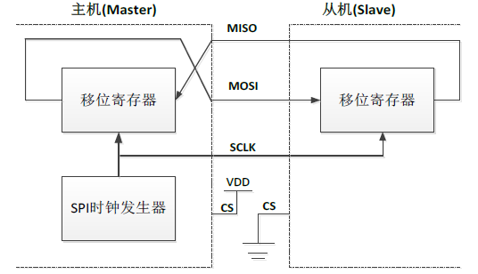
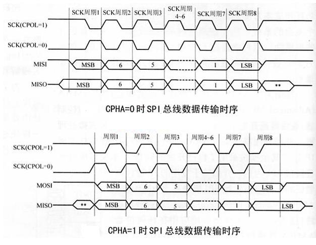
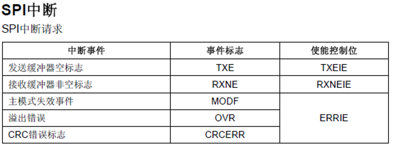

## SPI协议

SPI是英语Serial Peripheral interface的缩写，顾名思义就是串行外围设备接口。是Motorola首先在其MC68HCXX系列处理器上定义的。SPI接口主要应用在 EEPROM，FLASH，实时时钟，AD转换器，还有数字信号处理器和数字信号解码器之间。SPI，是一种高速的，全双工，同步的通信总线，并且在芯片的管脚上只占用四根线，节约了芯片的管脚，同时为PCB 的布局上节省空间，提供方便。




SPI 接口一般使用4 条线通信：

- MISO 主设备数据输入，从设备数据输出。
- MOSI 主设备数据输出，从设备数据输入。
- SCLK 时钟信号，由主设备产生。
- CS 从设备片选信号，由主设备控制。

从图中可以看出，主机和从机都有一个串行移位寄存器，主机通过向它的SPI 串行寄存器写入一个字节来发起一次传输。寄存器通过MOSI信号线将字节传送给从机，从机也将自己的移位寄存器中的内容通过MISO信号线返回给主机。这样，两个移位寄存器中的内容就被交换。外设的写操作和读操作是同步完成的。如果只进行写操作，主机只需忽略接收到的字节；反之，若主机要读取从机的一个字节，就必须发送一个空字节来引发从机的传输。

### SPI主要特点有：

可以同时发出和接收串行数据；可以当作主机或从机工作；提供频率可编程时钟；发送结束中断标志；写冲突保护；总线竞争保护等。

- 3线全双工同步传输
- 8或16位传输帧格式选择
- 主或从操作
- 支持多主模式
- 8个主模式波特率预分频系数（最大为$f_{pclk}/2$）
- 主模式和从模式下均可以由软件或硬件进行NSS管理；主/从操作模式的动态改变
- 可编程的时钟极性和相位
- 可编程的数据顺序，MSB在前或LSB在前
- 可触发中断的专用发送和接收标志
- SPI总线忙状态标志
- 支持可靠通信的硬件CRC

### SPI总线四种工作方式SPI模块为了和外设进行数据交换，根据外设工作要求，其输出串行同步时钟极性和相位可以进行配置，时钟极性（CPOL）对传输协议没有重大的影响。

如果CPOL=0，串行同步时钟的空闲状态为低电平；

如果CPOL=1，串行同步时钟的空闲状态为高电平。时钟相位（CPHA）能够配置用于选择两种不同的传输协议之一进行数据传输。

如果CPHA=0，在串行同步时钟的第一个跳变沿（上升或下降）数据被采样；

如果CPHA=1，在串行同步时钟的第二个跳变沿（上升或下降）数据被采样。

SPI主模块和与之通信的外设备时钟相位和极性应该一致。

不同时钟相位下的总线数据传输时序：



## SPI程序

SPI时钟频率最大为18MHz。

### SPI参数结构体

``` C
typedef struct
{
    uint16_t SPI_Direction;
    uint16_t SPI_Mode;
    uint16_t SPI_DataSize;
    uint16_t SPI_CPOL;
    uint16_t SPI_CPHA;
    uint16_t SPI_NSS;
    uint16_t SPI_BaudRatePrescaler;
    uint16_t SPI_FirstBit;
    uint16_t SPI_CRCPolynomial;
} SPI_InitTypeDef;
```

- 第一个参数SPI_Direction是用来设置SPI的通信方式 ，可以选择为半双工，全双工，及串行发和串行收方式。

- 第二个参数SPI_Mode用来设置SPI的主从模式。

- 第三个参数SPI_DataSize为8位还是16位帧格式选择项。

- 第四个参数SPI_CPOL用来设置时钟极性。

- 第五个参数SPI_CPHA用来设置时钟相位，用来设置时钟相位，也就是选择在串行同步时钟的第几个跳变沿（上升或下降）数据被采样，可以为第一个或者二条边沿采集。

- 第六个参数SPI_NSS设置NSS信号由硬件（NSS管脚）还是软件控制。
    - 软件NSS模式：可以通过设置SPI_CR1寄存器的SSM位来使能这种模式，在这种模式下NSS引脚可以用作它讲，而内部NSS信号电平可以通过写SPI_CR1的SSI位来驱动。
    - 硬件NSS模式，分两种情况：
      - NSS输出被使能，当STM32F10xx工作为主SPI，并且NSS输出已经通过SPI_CR2寄存器的SSOE位使能，这时NSS引脚被拉低，所有NSS引脚与这个主SPI的NSS引脚相连并配置位硬件NSS的SPI设备，将自动变成从SPI设备。当一个SPI设备需要发送广播数据，它必须拉低NSS信号，以通知所有其它的设备它是主设备；如果它不能拉低NSS，这意味着总线上有另外一个主设备在通信，这时将产生一个硬件失败错误(Hard Fault)
      - NSS输出被关闭：允许操作于多主环境。


- 第七个参数SPI_BaudRatePrescaler很关键，就是设置SPI波特率预分频值就是决定SPI的时钟的参数，从不分频道256分频8个可选值。

- 第八个参数SPI_FirstBit设置数据传输顺序是MSB位在前还是LSB位在前。

- 第九个参数SPI_CRCPolynomial是用来设置CRC校验多项式，提高通信可靠性， 大于1即可。

### 初始化的范例格式

``` C
SPI_InitTypeDef InitStructure;
SPI_InitStructure.SPI_Direction = SPI_Direction_2Lines_FullDuplex;  //设置SPI单向或者双向的数据模式:SPI设置为双线双向全双工
SPI_InitStructure.SPI_Mode = SPI_Mode_Master;		//设置SPI工作模式:设置为主SPI
SPI_InitStructure.SPI_DataSize = SPI_DataSize_8b;		//设置SPI的数据大小:SPI发送接收8位帧结构
SPI_InitStructure.SPI_CPOL = SPI_CPOL_High;		//串行同步时钟的空闲状态为高电平
SPI_InitStructure.SPI_CPHA = SPI_CPHA_2Edge;	//串行同步时钟的第二个跳变沿（上升或下降）数据被采样
SPI_InitStructure.SPI_NSS = SPI_NSS_Soft;		//NSS信号由硬件（NSS管脚）还是软件（使用SSI位）管理:内部NSS信号有SSI位控制
SPI_InitStructure.SPI_BaudRatePrescaler = SPI_BaudRatePrescaler_256;		//定义波特率预分频的值:波特率预分频值为256  36M/256=140.625KHz
SPI_InitStructure.SPI_FirstBit = SPI_FirstBit_MSB;	//指定数据传输从MSB位还是LSB位开始:数据传输从MSB位开始
SPI_InitStructure.SPI_CRCPolynomial = 7;	//CRC值计算的多项式
SPI_Init(SPI2, &SPI_InitStructure);  //根据SPI_InitStruct中指定的参数初始化外设SPIx寄存器
```

### 使能SPI外设

``` C
SPI_Cmd(SPI2, ENABLE); //使能SPI外设
```

### SPI传输数据

``` C
void SPI_I2S_SendData(TypeDef* SPIx, uint16_t Data); 
```

### 查看SPI传输状态

``` C
FlagStatus SPI_I2S_GetFlagStatus(SPI_TypeDef* SPIx, uint16_t SPI_I2S_FLAG);
```

### SPI相关的函数

``` C
void SPI_I2S_DeInit(SPI_TypeDef* SPIx);
void SPI_Init(SPI_TypeDef* SPIx, SPI_InitTypeDef* SPI_InitStruct);
void SPI_Cmd(SPI_TypeDef* SPIx, FunctionalState NewState);
void SPI_I2S_ITConfig(SPI_TypeDef* SPIx, uint8_t SPI_I2S_IT, FunctionalState NewState);
void SPI_I2S_DMACmd(SPI_TypeDef* SPIx, uint16_t SPI_I2S_DMAReq, FunctionalState NewState);
void SPI_I2S_SendData(SPI_TypeDef* SPIx, uint16_t Data);
uint16_t SPI_I2S_ReceiveData(SPI_TypeDef* SPIx);
void SPI_DataSizeConfig(SPI_TypeDef* SPIx, uint16_t SPI_DataSize);

FlagStatus SPI_I2S_GetFlagStatus(SPI_TypeDef* SPIx, uint16_t SPI_I2S_FLAG);
void SPI_I2S_ClearFlag(SPI_TypeDef* SPIx, uint16_t SPI_I2S_FLAG);
ITStatus SPI_I2S_GetITStatus(SPI_TypeDef* SPIx, uint8_t SPI_I2S_IT);
void SPI_I2S_ClearITPendingBit(SPI_TypeDef* SPIx, uint8_t SPI_I2S_IT);
```

### SPI中断



``` C
void SPIx_IRQHandler(void) 
```


